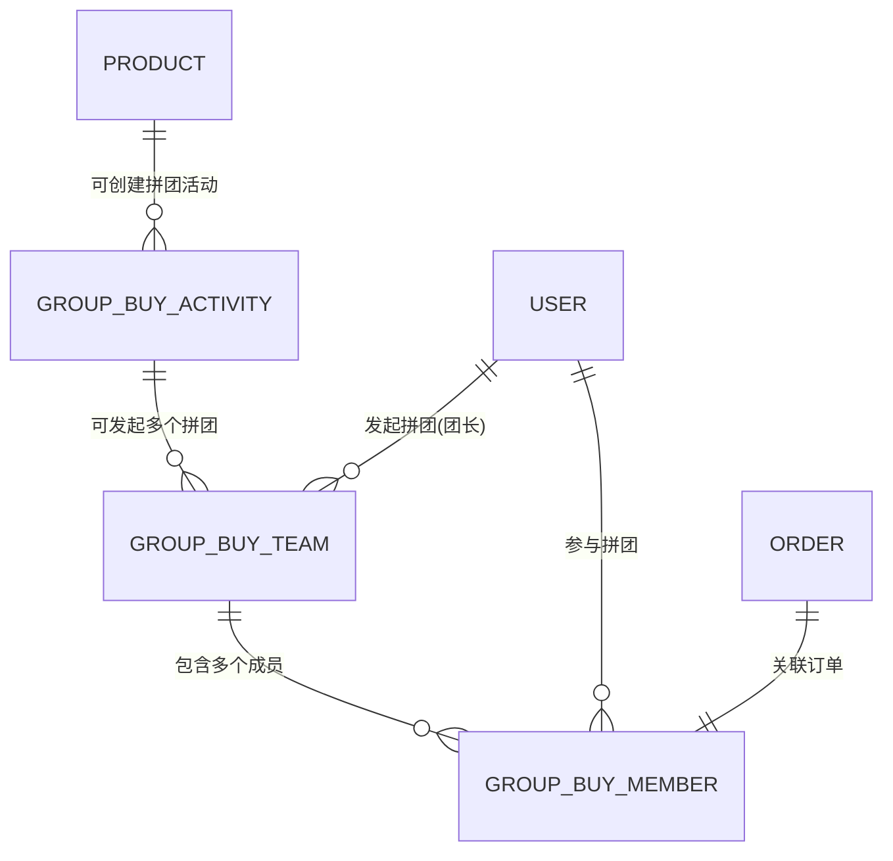
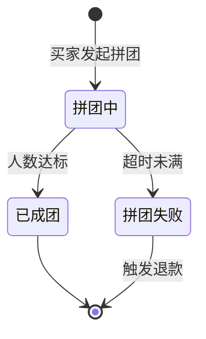

# 数据模型文档 — 拼团购买功能新增

> **定位：** 定义拼团购买功能新增的数据结构和存储设计。
> **变更说明：** 本次新增 3 张数据表，用于支撑拼团购买功能。

---

## 1. 文档信息

| 字段 | 内容 |
|------|------|
| 项目名称 | 校园二手交易平台 |
| 版本 | V1.1 |
| 数据库类型 | MySQL |
| 关联文档 | [产品需求文档](./02-产品需求文档.md)、[技术架构文档](./03-技术架构文档.md) |

---

## 2. 新增 ER 关系图



---

## 3. 新增数据表设计

### 3.1 group_buy_activity (拼团活动表)

**表说明：** 存储卖家创建的拼团活动定义信息，一个商品同时只能有一个进行中的拼团活动。

| 字段名 | 类型 | 约束 | 默认值 | 说明 |
|--------|------|------|--------|------|
| id | BIGINT | PK, AUTO_INCREMENT | - | 拼团活动ID |
| product_id | BIGINT | FK, NOT NULL | - | 关联商品ID |
| seller_id | BIGINT | FK, NOT NULL | - | 卖家用户ID |
| original_price | DECIMAL(10,2) | NOT NULL | - | 商品原价（冗余，创建时快照） |
| group_price | DECIMAL(10,2) | NOT NULL | - | 拼团价格 |
| target_count | INT | NOT NULL | - | 目标拼团人数（2-10） |
| stock | INT | NOT NULL | - | 拼团库存数量 |
| duration_hours | INT | NOT NULL | - | 拼团有效时长（小时，1-72） |
| status | TINYINT | NOT NULL | 0 | 活动状态：0-进行中 1-已结束 2-已取消 |
| created_at | DATETIME | NOT NULL | CURRENT_TIMESTAMP | 创建时间 |
| updated_at | DATETIME | NOT NULL | CURRENT_TIMESTAMP ON UPDATE | 更新时间 |

**索引设计：**

| 索引名 | 字段 | 类型 | 说明 |
|--------|------|------|------|
| idx_product_id | product_id | INDEX | 按商品查询拼团活动 |
| idx_seller_id | seller_id | INDEX | 按卖家查询其拼团活动 |
| idx_status | status | INDEX | 按状态筛选进行中的活动 |
| uk_product_active | product_id, status | UNIQUE | 保证同一商品只有一个进行中的活动（status=0时） |

**外键关系：**

| 字段 | 关联表 | 关联字段 | 关系类型 | 级联规则 |
|------|--------|----------|----------|----------|
| product_id | product | id | N:1 | RESTRICT |
| seller_id | user | id | N:1 | RESTRICT |

---

### 3.2 group_buy_team (拼团单表)

**表说明：** 存储每一次具体的拼团实例，由买家发起，记录拼团进度和状态。

| 字段名 | 类型 | 约束 | 默认值 | 说明 |
|--------|------|------|--------|------|
| id | BIGINT | PK, AUTO_INCREMENT | - | 拼团单ID |
| activity_id | BIGINT | FK, NOT NULL | - | 关联拼团活动ID |
| leader_id | BIGINT | FK, NOT NULL | - | 团长用户ID |
| target_count | INT | NOT NULL | - | 目标人数（冗余自活动） |
| current_count | INT | NOT NULL | 1 | 当前参团人数 |
| status | TINYINT | NOT NULL | 0 | 拼团状态：0-拼团中 1-已成团 2-拼团失败 |
| expire_at | DATETIME | NOT NULL | - | 拼团过期时间 |
| success_at | DATETIME | NULL | NULL | 成团时间 |
| created_at | DATETIME | NOT NULL | CURRENT_TIMESTAMP | 创建时间 |
| updated_at | DATETIME | NOT NULL | CURRENT_TIMESTAMP ON UPDATE | 更新时间 |

**索引设计：**

| 索引名 | 字段 | 类型 | 说明 |
|--------|------|------|------|
| idx_activity_id | activity_id | INDEX | 按活动查询拼团单 |
| idx_leader_id | leader_id | INDEX | 按团长查询 |
| idx_status_expire | status, expire_at | INDEX | 定时任务扫描过期拼团 |
| idx_expire_at | expire_at | INDEX | 按过期时间排序 |

**外键关系：**

| 字段 | 关联表 | 关联字段 | 关系类型 | 级联规则 |
|------|--------|----------|----------|----------|
| activity_id | group_buy_activity | id | N:1 | RESTRICT |
| leader_id | user | id | N:1 | RESTRICT |

---

### 3.3 group_buy_member (拼团成员表)

**表说明：** 记录每个拼团的参与者信息，包括团长和普通成员。

| 字段名 | 类型 | 约束 | 默认值 | 说明 |
|--------|------|------|--------|------|
| id | BIGINT | PK, AUTO_INCREMENT | - | 记录ID |
| team_id | BIGINT | FK, NOT NULL | - | 关联拼团单ID |
| user_id | BIGINT | FK, NOT NULL | - | 参与用户ID |
| order_id | BIGINT | FK, NOT NULL | - | 关联订单ID |
| is_leader | TINYINT | NOT NULL | 0 | 是否为团长：0-否 1-是 |
| status | TINYINT | NOT NULL | 0 | 成员状态：0-已参团 1-已退出 2-已退款 |
| joined_at | DATETIME | NOT NULL | CURRENT_TIMESTAMP | 加入时间 |

**索引设计：**

| 索引名 | 字段 | 类型 | 说明 |
|--------|------|------|------|
| uk_team_user | team_id, user_id | UNIQUE | 同一用户不能重复参与同一拼团 |
| idx_user_id | user_id | INDEX | 按用户查询其参与的拼团 |
| idx_order_id | order_id | UNIQUE | 按订单查询拼团信息 |

**外键关系：**

| 字段 | 关联表 | 关联字段 | 关系类型 | 级联规则 |
|------|--------|----------|----------|----------|
| team_id | group_buy_team | id | N:1 | RESTRICT |
| user_id | user | id | N:1 | RESTRICT |
| order_id | order | id | 1:1 | RESTRICT |

---

## 4. 枚举值与状态定义

### 4.1 拼团活动状态 (GroupBuyActivityStatus)

| 值 | 标签 | 说明 |
|----|------|------|
| 0 | 进行中 | 活动正常进行，可以发起/参与拼团 |
| 1 | 已结束 | 活动正常结束（库存售罄或手动关闭） |
| 2 | 已取消 | 活动被卖家取消 |

### 4.2 拼团单状态 (GroupBuyTeamStatus)

| 值 | 标签 | 说明 |
|----|------|------|
| 0 | 拼团中 | 等待更多用户加入 |
| 1 | 已成团 | 人数达标，拼团成功 |
| 2 | 拼团失败 | 超时未满，拼团失败 |

### 4.3 拼团成员状态 (GroupBuyMemberStatus)

| 值 | 标签 | 说明 |
|----|------|------|
| 0 | 已参团 | 正常参团中 |
| 1 | 已退出 | 用户主动退出（仅拼团中状态可退出） |
| 2 | 已退款 | 拼团失败，已完成退款 |

### 4.4 拼团单状态流转图



---

## 5. 数据库迁移 SQL

```sql
-- 拼团活动表
CREATE TABLE group_buy_activity (
    id BIGINT AUTO_INCREMENT PRIMARY KEY,
    product_id BIGINT NOT NULL COMMENT '关联商品ID',
    seller_id BIGINT NOT NULL COMMENT '卖家用户ID',
    original_price DECIMAL(10,2) NOT NULL COMMENT '商品原价快照',
    group_price DECIMAL(10,2) NOT NULL COMMENT '拼团价格',
    target_count INT NOT NULL COMMENT '目标拼团人数',
    stock INT NOT NULL COMMENT '拼团库存',
    duration_hours INT NOT NULL COMMENT '有效时长(小时)',
    status TINYINT NOT NULL DEFAULT 0 COMMENT '状态:0-进行中 1-已结束 2-已取消',
    created_at DATETIME NOT NULL DEFAULT CURRENT_TIMESTAMP,
    updated_at DATETIME NOT NULL DEFAULT CURRENT_TIMESTAMP ON UPDATE CURRENT_TIMESTAMP,
    INDEX idx_product_id (product_id),
    INDEX idx_seller_id (seller_id),
    INDEX idx_status (status)
) ENGINE=InnoDB DEFAULT CHARSET=utf8mb4 COMMENT='拼团活动表';

-- 拼团单表
CREATE TABLE group_buy_team (
    id BIGINT AUTO_INCREMENT PRIMARY KEY,
    activity_id BIGINT NOT NULL COMMENT '关联拼团活动ID',
    leader_id BIGINT NOT NULL COMMENT '团长用户ID',
    target_count INT NOT NULL COMMENT '目标人数',
    current_count INT NOT NULL DEFAULT 1 COMMENT '当前参团人数',
    status TINYINT NOT NULL DEFAULT 0 COMMENT '状态:0-拼团中 1-已成团 2-拼团失败',
    expire_at DATETIME NOT NULL COMMENT '过期时间',
    success_at DATETIME NULL COMMENT '成团时间',
    created_at DATETIME NOT NULL DEFAULT CURRENT_TIMESTAMP,
    updated_at DATETIME NOT NULL DEFAULT CURRENT_TIMESTAMP ON UPDATE CURRENT_TIMESTAMP,
    INDEX idx_activity_id (activity_id),
    INDEX idx_leader_id (leader_id),
    INDEX idx_status_expire (status, expire_at),
    INDEX idx_expire_at (expire_at)
) ENGINE=InnoDB DEFAULT CHARSET=utf8mb4 COMMENT='拼团单表';

-- 拼团成员表
CREATE TABLE group_buy_member (
    id BIGINT AUTO_INCREMENT PRIMARY KEY,
    team_id BIGINT NOT NULL COMMENT '关联拼团单ID',
    user_id BIGINT NOT NULL COMMENT '参与用户ID',
    order_id BIGINT NOT NULL COMMENT '关联订单ID',
    is_leader TINYINT NOT NULL DEFAULT 0 COMMENT '是否团长:0-否 1-是',
    status TINYINT NOT NULL DEFAULT 0 COMMENT '状态:0-已参团 1-已退出 2-已退款',
    joined_at DATETIME NOT NULL DEFAULT CURRENT_TIMESTAMP COMMENT '加入时间',
    UNIQUE KEY uk_team_user (team_id, user_id),
    UNIQUE KEY idx_order_id (order_id),
    INDEX idx_user_id (user_id)
) ENGINE=InnoDB DEFAULT CHARSET=utf8mb4 COMMENT='拼团成员表';
```

---

## 文档变更记录

| 版本 | 日期 | 变更内容 | 变更原因 |
|------|------|----------|----------|
| V1.0 | - | 初始版本 | 数据模型初始设计 |
| V1.1 | 2025-07-17 | 新增拼团相关 3 张数据表 | 拼团购买功能需求 |
