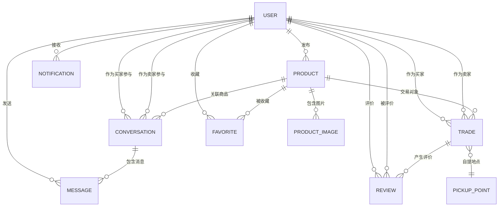
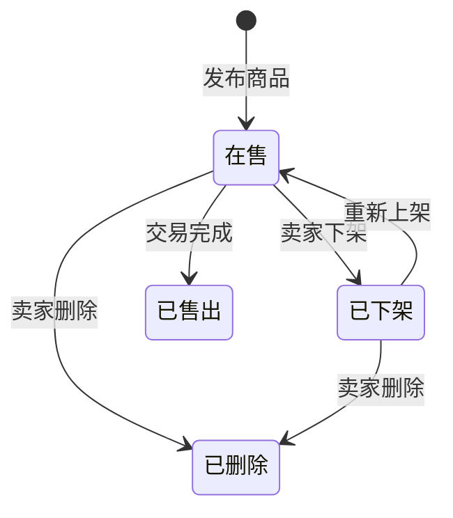
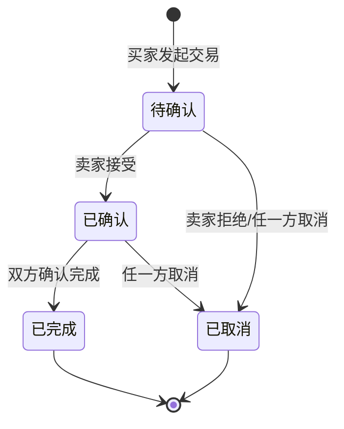

# 数据模型文档

> **定位：** 定义系统的数据结构和存储设计，是 AI 编写数据层代码的唯一参照。
> **生成时机：** 技术架构文档确认后，由 AI 基于产品需求文档中的数据需求和技术架构文档生成。
> **使用方式：** AI 编码时所有数据表、字段、索引必须与本文档一致，不得自行添加未定义的表或字段。

---

## 1. 文档信息

| 字段 | 内容 |
|------|------|
| 项目名称 | 校园二手交易平台 |
| 版本 | V1.0 |
| 数据库类型 | MySQL 8.0 |
| 关联文档 | [产品需求文档](./02-产品需求文档.md)、[技术架构文档](./03-技术架构文档.md) |

---

## 2. ER 关系图

---

## 3. 数据表设计

> **⚠️ AI 约束：每张表的字段定义是强约束，AI 不得在编码时添加本文档未定义的字段。如需新增字段，必须先更新本文档。**

### 3.1 user（用户表）

**表说明：** 存储平台用户基本信息和认证状态

| 字段名 | 类型 | 约束 | 默认值 | 说明 |
|--------|------|------|--------|------|
| id | BIGINT | PK, AUTO_INCREMENT | - | 用户主键 |
| student_id | VARCHAR(20) | NOT NULL, UNIQUE | - | 学号 |
| password_hash | VARCHAR(255) | NOT NULL | - | BCrypt 加密密码 |
| nickname | VARCHAR(30) | NOT NULL | - | 昵称 |
| avatar_url | VARCHAR(500) | NULL | NULL | 头像 URL |
| email | VARCHAR(100) | NULL, UNIQUE | NULL | 学校邮箱 |
| bio | VARCHAR(200) | NULL | NULL | 个人简介 |
| auth_status | TINYINT | NOT NULL | 0 | 认证状态：0=未认证,1=已认证 |
| credit_score | DECIMAL(3,1) | NOT NULL | 5.0 | 信用积分(1.0-5.0) |
| status | TINYINT | NOT NULL | 1 | 账号状态：0=禁用,1=正常,2=锁定 |
| login_fail_count | INT | NOT NULL | 0 | 连续登录失败次数 |
| lock_until | DATETIME | NULL | NULL | 锁定截止时间 |
| created_at | DATETIME | NOT NULL | CURRENT_TIMESTAMP | 创建时间 |
| updated_at | DATETIME | NOT NULL | CURRENT_TIMESTAMP ON UPDATE | 更新时间 |

**索引设计：**

| 索引名 | 字段 | 类型 | 说明 |
|--------|------|------|------|
| uk_student_id | student_id | UNIQUE | 学号唯一索引 |
| uk_email | email | UNIQUE | 邮箱唯一索引 |
| idx_auth_status | auth_status | INDEX | 认证状态查询 |

### 3.2 email_verification（邮箱验证表）

**表说明：** 存储邮箱验证令牌

| 字段名 | 类型 | 约束 | 默认值 | 说明 |
|--------|------|------|--------|------|
| id | BIGINT | PK, AUTO_INCREMENT | - | 主键 |
| user_id | BIGINT | NOT NULL, FK | - | 关联用户 |
| token | VARCHAR(255) | NOT NULL, UNIQUE | - | 验证令牌 |
| email | VARCHAR(100) | NOT NULL | - | 验证邮箱 |
| expired_at | DATETIME | NOT NULL | - | 过期时间（30分钟） |
| used | TINYINT | NOT NULL | 0 | 是否已使用：0=未使用,1=已使用 |
| created_at | DATETIME | NOT NULL | CURRENT_TIMESTAMP | 创建时间 |

**外键关系：**

| 字段 | 关联表 | 关联字段 | 关系类型 | 级联规则 |
|------|--------|----------|----------|----------|
| user_id | user | id | N:1 | CASCADE |

### 3.3 product（商品表）

**表说明：** 存储闲置商品信息

| 字段名 | 类型 | 约束 | 默认值 | 说明 |
|--------|------|------|--------|------|
| id | BIGINT | PK, AUTO_INCREMENT | - | 商品主键 |
| seller_id | BIGINT | NOT NULL, FK | - | 卖家用户ID |
| title | VARCHAR(50) | NOT NULL | - | 商品标题(5-50字) |
| description | TEXT | NOT NULL | - | 商品描述(10-500字) |
| price | DECIMAL(7,2) | NOT NULL | - | 商品价格(0.01-99999.99) |
| category | VARCHAR(20) | NOT NULL | - | 商品分类 |
| condition_level | TINYINT | NOT NULL | - | 成色等级：1=全新,2=几乎全新,3=轻微使用,4=明显使用 |
| status | TINYINT | NOT NULL | 1 | 状态：0=已删除,1=在售,2=已下架,3=已售出 |
| view_count | INT | NOT NULL | 0 | 浏览次数 |
| created_at | DATETIME | NOT NULL | CURRENT_TIMESTAMP | 发布时间 |
| updated_at | DATETIME | NOT NULL | CURRENT_TIMESTAMP ON UPDATE | 更新时间 |

**索引设计：**

| 索引名 | 字段 | 类型 | 说明 |
|--------|------|------|------|
| idx_seller_id | seller_id | INDEX | 按卖家查询商品 |
| idx_category | category | INDEX | 按分类筛选 |
| idx_status | status | INDEX | 按状态过滤 |
| idx_created_at | created_at | INDEX | 按时间排序 |
| ft_title_desc | title, description | FULLTEXT | 全文搜索 |

**外键关系：**

| 字段 | 关联表 | 关联字段 | 关系类型 | 级联规则 |
|------|--------|----------|----------|----------|
| seller_id | user | id | N:1 | RESTRICT |

### 3.4 product_image（商品图片表）

**表说明：** 存储商品图片信息

| 字段名 | 类型 | 约束 | 默认值 | 说明 |
|--------|------|------|--------|------|
| id | BIGINT | PK, AUTO_INCREMENT | - | 主键 |
| product_id | BIGINT | NOT NULL, FK | - | 关联商品 |
| image_url | VARCHAR(500) | NOT NULL | - | 图片 URL |
| sort_order | INT | NOT NULL | 0 | 排序序号 |
| created_at | DATETIME | NOT NULL | CURRENT_TIMESTAMP | 创建时间 |

**外键关系：**

| 字段 | 关联表 | 关联字段 | 关系类型 | 级联规则 |
|------|--------|----------|----------|----------|
| product_id | product | id | N:1 | CASCADE |

### 3.5 conversation（会话表）

**表说明：** 存储聊天会话信息，每个商品每对买卖关系对应一个会话

| 字段名 | 类型 | 约束 | 默认值 | 说明 |
|--------|------|------|--------|------|
| id | BIGINT | PK, AUTO_INCREMENT | - | 会话主键 |
| product_id | BIGINT | NOT NULL, FK | - | 关联商品 |
| buyer_id | BIGINT | NOT NULL, FK | - | 买家ID |
| seller_id | BIGINT | NOT NULL, FK | - | 卖家ID |
| last_message_content | VARCHAR(500) | NULL | NULL | 最新消息内容摘要 |
| last_message_time | DATETIME | NULL | NULL | 最新消息时间 |
| buyer_unread_count | INT | NOT NULL | 0 | 买家未读消息数 |
| seller_unread_count | INT | NOT NULL | 0 | 卖家未读消息数 |
| created_at | DATETIME | NOT NULL | CURRENT_TIMESTAMP | 创建时间 |
| updated_at | DATETIME | NOT NULL | CURRENT_TIMESTAMP ON UPDATE | 更新时间 |

**索引设计：**

| 索引名 | 字段 | 类型 | 说明 |
|--------|------|------|------|
| uk_product_buyer | product_id, buyer_id | UNIQUE | 同一商品同一买家唯一会话 |
| idx_buyer_id | buyer_id | INDEX | 按买家查询会话 |
| idx_seller_id | seller_id | INDEX | 按卖家查询会话 |
| idx_last_msg_time | last_message_time | INDEX | 按最新消息排序 |

**外键关系：**

| 字段 | 关联表 | 关联字段 | 关系类型 | 级联规则 |
|------|--------|----------|----------|----------|
| product_id | product | id | N:1 | RESTRICT |
| buyer_id | user | id | N:1 | RESTRICT |
| seller_id | user | id | N:1 | RESTRICT |

### 3.6 message（消息表）

**表说明：** 存储聊天消息

| 字段名 | 类型 | 约束 | 默认值 | 说明 |
|--------|------|------|--------|------|
| id | BIGINT | PK, AUTO_INCREMENT | - | 消息主键 |
| conversation_id | BIGINT | NOT NULL, FK | - | 关联会话 |
| sender_id | BIGINT | NOT NULL, FK | - | 发送者ID |
| content | TEXT | NOT NULL | - | 消息内容 |
| message_type | TINYINT | NOT NULL | 1 | 消息类型：1=文本,2=图片 |
| created_at | DATETIME | NOT NULL | CURRENT_TIMESTAMP | 发送时间 |

**索引设计：**

| 索引名 | 字段 | 类型 | 说明 |
|--------|------|------|------|
| idx_conversation_id | conversation_id | INDEX | 按会话查询消息 |
| idx_created_at | created_at | INDEX | 按时间排序 |

**外键关系：**

| 字段 | 关联表 | 关联字段 | 关系类型 | 级联规则 |
|------|--------|----------|----------|----------|
| conversation_id | conversation | id | N:1 | CASCADE |
| sender_id | user | id | N:1 | RESTRICT |

### 3.7 trade（交易表）

**表说明：** 存储买卖交易记录

| 字段名 | 类型 | 约束 | 默认值 | 说明 |
|--------|------|------|--------|------|
| id | BIGINT | PK, AUTO_INCREMENT | - | 交易主键 |
| product_id | BIGINT | NOT NULL, FK | - | 关联商品 |
| buyer_id | BIGINT | NOT NULL, FK | - | 买家ID |
| seller_id | BIGINT | NOT NULL, FK | - | 卖家ID |
| price | DECIMAL(7,2) | NOT NULL | - | 成交价格 |
| status | TINYINT | NOT NULL | 0 | 交易状态：0=待确认,1=已确认,2=已完成,3=已取消 |
| pickup_point_id | BIGINT | NULL, FK | NULL | 预设自提点ID |
| pickup_location | VARCHAR(200) | NULL | NULL | 自定义自提地点描述 |
| pickup_time | DATETIME | NULL | NULL | 约定自提时间 |
| cancel_reason | VARCHAR(200) | NULL | NULL | 取消原因 |
| completed_at | DATETIME | NULL | NULL | 交易完成时间 |
| created_at | DATETIME | NOT NULL | CURRENT_TIMESTAMP | 创建时间 |
| updated_at | DATETIME | NOT NULL | CURRENT_TIMESTAMP ON UPDATE | 更新时间 |

**索引设计：**

| 索引名 | 字段 | 类型 | 说明 |
|--------|------|------|------|
| idx_product_id | product_id | INDEX | 按商品查询交易 |
| idx_buyer_id | buyer_id | INDEX | 按买家查询交易 |
| idx_seller_id | seller_id | INDEX | 按卖家查询交易 |
| idx_status | status | INDEX | 按状态过滤 |

**外键关系：**

| 字段 | 关联表 | 关联字段 | 关系类型 | 级联规则 |
|------|--------|----------|----------|----------|
| product_id | product | id | N:1 | RESTRICT |
| buyer_id | user | id | N:1 | RESTRICT |
| seller_id | user | id | N:1 | RESTRICT |
| pickup_point_id | pickup_point | id | N:1 | SET NULL |

### 3.8 review（评价表）

**表说明：** 存储交易评价

| 字段名 | 类型 | 约束 | 默认值 | 说明 |
|--------|------|------|--------|------|
| id | BIGINT | PK, AUTO_INCREMENT | - | 评价主键 |
| trade_id | BIGINT | NOT NULL, FK | - | 关联交易 |
| reviewer_id | BIGINT | NOT NULL, FK | - | 评价者ID |
| reviewee_id | BIGINT | NOT NULL, FK | - | 被评价者ID |
| rating | TINYINT | NOT NULL | - | 评分(1-5) |
| content | VARCHAR(200) | NULL | NULL | 评价内容 |
| created_at | DATETIME | NOT NULL | CURRENT_TIMESTAMP | 评价时间 |

**索引设计：**

| 索引名 | 字段 | 类型 | 说明 |
|--------|------|------|------|
| uk_trade_reviewer | trade_id, reviewer_id | UNIQUE | 同一交易同一人仅可评价一次 |
| idx_reviewee_id | reviewee_id | INDEX | 按被评者查询评价 |

**外键关系：**

| 字段 | 关联表 | 关联字段 | 关系类型 | 级联规则 |
|------|--------|----------|----------|----------|
| trade_id | trade | id | N:1 | RESTRICT |
| reviewer_id | user | id | N:1 | RESTRICT |
| reviewee_id | user | id | N:1 | RESTRICT |

### 3.9 favorite（收藏表）

**表说明：** 存储用户的商品收藏关系

| 字段名 | 类型 | 约束 | 默认值 | 说明 |
|--------|------|------|--------|------|
| id | BIGINT | PK, AUTO_INCREMENT | - | 主键 |
| user_id | BIGINT | NOT NULL, FK | - | 用户ID |
| product_id | BIGINT | NOT NULL, FK | - | 商品ID |
| created_at | DATETIME | NOT NULL | CURRENT_TIMESTAMP | 收藏时间 |

**索引设计：**

| 索引名 | 字段 | 类型 | 说明 |
|--------|------|------|------|
| uk_user_product | user_id, product_id | UNIQUE | 同一用户同一商品仅收藏一次 |
| idx_user_id | user_id | INDEX | 按用户查询收藏 |

**外键关系：**

| 字段 | 关联表 | 关联字段 | 关系类型 | 级联规则 |
|------|--------|----------|----------|----------|
| user_id | user | id | N:1 | CASCADE |
| product_id | product | id | N:1 | CASCADE |

### 3.10 notification（通知表）

**表说明：** 存储系统通知

| 字段名 | 类型 | 约束 | 默认值 | 说明 |
|--------|------|------|--------|------|
| id | BIGINT | PK, AUTO_INCREMENT | - | 主键 |
| user_id | BIGINT | NOT NULL, FK | - | 接收用户ID |
| type | TINYINT | NOT NULL | - | 通知类型：1=交易通知,2=聊天通知,3=系统通知 |
| title | VARCHAR(100) | NOT NULL | - | 通知标题 |
| content | VARCHAR(500) | NOT NULL | - | 通知内容 |
| related_id | BIGINT | NULL | NULL | 关联业务ID（交易ID/会话ID等） |
| is_read | TINYINT | NOT NULL | 0 | 是否已读：0=未读,1=已读 |
| created_at | DATETIME | NOT NULL | CURRENT_TIMESTAMP | 创建时间 |

**索引设计：**

| 索引名 | 字段 | 类型 | 说明 |
|--------|------|------|------|
| idx_user_id | user_id | INDEX | 按用户查询通知 |
| idx_user_read | user_id, is_read | INDEX | 查询用户未读通知 |
| idx_created_at | created_at | INDEX | 按时间排序 |

**外键关系：**

| 字段 | 关联表 | 关联字段 | 关系类型 | 级联规则 |
|------|--------|----------|----------|----------|
| user_id | user | id | N:1 | CASCADE |

### 3.11 pickup_point（自提点表）

**表说明：** 存储校内预设自提地点

| 字段名 | 类型 | 约束 | 默认值 | 说明 |
|--------|------|------|--------|------|
| id | BIGINT | PK, AUTO_INCREMENT | - | 主键 |
| name | VARCHAR(50) | NOT NULL | - | 地点名称 |
| description | VARCHAR(200) | NULL | NULL | 地点描述 |
| sort_order | INT | NOT NULL | 0 | 排序序号 |
| is_active | TINYINT | NOT NULL | 1 | 是否启用：0=禁用,1=启用 |
| created_at | DATETIME | NOT NULL | CURRENT_TIMESTAMP | 创建时间 |

---

## 4. 枚举值与状态定义

> **⚠️ AI 约束：代码中涉及枚举值和状态流转时，必须与以下定义完全一致。**

### 4.1 枚举值定义

#### 用户认证状态 (AuthStatus)

| 值 | 标签 | 说明 |
|----|------|------|
| 0 | 未认证 | 新注册用户，未完成邮箱验证 |
| 1 | 已认证 | 已通过学校邮箱验证 |

#### 账号状态 (UserStatus)

| 值 | 标签 | 说明 |
|----|------|------|
| 0 | 禁用 | 账号被禁用 |
| 1 | 正常 | 正常使用 |
| 2 | 锁定 | 登录失败过多临时锁定 |

#### 商品状态 (ProductStatus)

| 值 | 标签 | 说明 |
|----|------|------|
| 0 | 已删除 | 软删除，不可恢复 |
| 1 | 在售 | 正常展示和交易 |
| 2 | 已下架 | 卖家手动下架，可重新上架 |
| 3 | 已售出 | 交易完成后自动更新 |

#### 商品成色 (ConditionLevel)

| 值 | 标签 | 说明 |
|----|------|------|
| 1 | 全新 | 未使用，包装完好 |
| 2 | 几乎全新 | 使用极少，无明显痕迹 |
| 3 | 轻微使用痕迹 | 正常使用，有轻微磨损 |
| 4 | 明显使用痕迹 | 使用较多，有明显磨损 |

#### 商品分类 (ProductCategory)

| 值 | 标签 | 说明 |
|----|------|------|
| DIGITAL | 数码电子 | 手机、电脑、平板等 |
| BOOKS | 书籍教材 | 教材、课外书等 |
| CLOTHING | 服饰鞋包 | 衣服、鞋子、包等 |
| DAILY | 生活用品 | 日常生活用品 |
| SPORTS | 运动户外 | 运动器材、户外用品 |
| BEAUTY | 美妆个护 | 化妆品、护肤品等 |
| OTHER | 其他 | 其他类别 |

#### 交易状态 (TradeStatus)

| 值 | 标签 | 说明 |
|----|------|------|
| 0 | 待确认 | 买家发起，等待卖家确认 |
| 1 | 已确认 | 卖家确认，约定自提中 |
| 2 | 已完成 | 双方确认交易完成 |
| 3 | 已取消 | 交易取消 |

#### 消息类型 (MessageType)

| 值 | 标签 | 说明 |
|----|------|------|
| 1 | 文本 | 文本消息 |
| 2 | 图片 | 图片消息（存储图片URL） |

#### 通知类型 (NotificationType)

| 值 | 标签 | 说明 |
|----|------|------|
| 1 | 交易通知 | 交易状态变更相关 |
| 2 | 聊天通知 | 新消息提醒 |
| 3 | 系统通知 | 系统公告和提醒 |

### 4.2 状态流转图

---

## 5. 数据迁移与初始化

### 5.1 初始数据

- **商品分类：** 预填充 7 个默认分类（数码电子、书籍教材、服饰鞋包、生活用品、运动户外、美妆个护、其他）
- **自提点：** 预填充常用校内自提点（校门口、1号食堂门口、图书馆大厅、学生活动中心、快递驿站门口）
- **系统管理员：** 预创建一个管理员账号用于系统管理

### 5.2 数据迁移策略

- 使用 Flyway 进行数据库版本管理
- 迁移脚本存放在 `backend/src/main/resources/db/migration/` 目录
- 命名规范：`V{版本号}__{描述}.sql`，如 `V1__init_schema.sql`
- 每次数据库结构变更必须通过迁移脚本执行，禁止手动修改数据库

---

## 6. 数据安全

| 安全措施 | 说明 |
|----------|------|
| 敏感数据加密 | password_hash 使用 BCrypt 加密存储；email_verification.token 使用 UUID 随机生成 |
| 数据脱敏 | 日志中不输出 password_hash 字段；API 响应中不返回 password_hash 字段；学号在部分场景做部分遮蔽显示 |
| 备份策略 | MySQL 每日凌晨 2:00 全量备份，保留最近 7 天备份；上传文件目录每日增量备份 |

---

## 文档变更记录

| 版本 | 日期 | 变更内容 | 变更原因 |
|------|------|----------|----------|
| V1.0 | 2025-07-17 | 初始版本 | 数据模型初始设计 |
