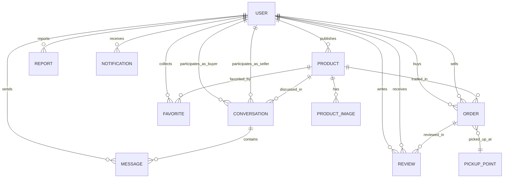
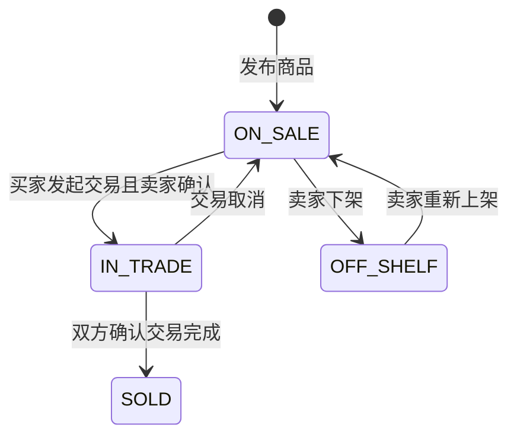
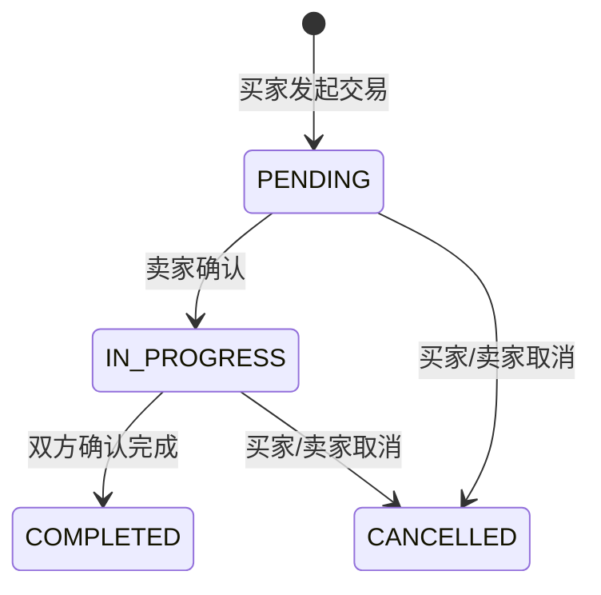

# 数据模型文档

> **定位：** 定义系统的数据结构和存储设计，是 AI 编写数据层代码的唯一参照。

---

## 1. 文档信息

| 字段 | 内容 |
|------|------|
| 项目名称 | 校园二手交易平台（CampusTrade） |
| 版本 | V1.0 |
| 数据库类型 | MySQL 8.0 |
| 关联文档 | [产品需求文档](./02-产品需求文档.md)、[技术架构文档](./03-技术架构文档.md) |

---

## 2. ER 关系图

---

## 3. 数据表设计

> **⚠️ AI 约束：每张表的字段定义是强约束，AI 不得在编码时添加本文档未定义的字段。如需新增字段，必须先更新本文档。**

### 3.1 user (用户表)

**表说明：** 存储平台用户基本信息和认证状态。

| 字段名 | 类型 | 约束 | 默认值 | 说明 |
|--------|------|------|--------|------|
| id | BIGINT | PK, AUTO_INCREMENT | - | 用户ID |
| email | VARCHAR(100) | NOT NULL, UNIQUE | - | 校园邮箱 |
| password_hash | VARCHAR(255) | NOT NULL | - | BCrypt 加密密码 |
| nickname | VARCHAR(50) | NOT NULL | - | 昵称 |
| avatar_url | VARCHAR(255) | | NULL | 头像 URL |
| bio | VARCHAR(200) | | NULL | 个人简介 |
| auth_status | TINYINT | NOT NULL | 0 | 认证状态：0-未认证 1-已认证 |
| role | VARCHAR(20) | NOT NULL | 'USER' | 角色：USER/ADMIN |
| credit_score | DECIMAL(3,2) | NOT NULL | 5.00 | 信用评分 1.00-5.00 |
| status | TINYINT | NOT NULL | 1 | 账号状态：0-封禁 1-正常 |
| created_at | DATETIME | NOT NULL | CURRENT_TIMESTAMP | 注册时间 |
| updated_at | DATETIME | NOT NULL | CURRENT_TIMESTAMP ON UPDATE | 更新时间 |

**索引设计：**

| 索引名 | 字段 | 类型 | 说明 |
|--------|------|------|------|
| uk_email | email | UNIQUE | 邮箱唯一索引 |
| idx_status | status | INDEX | 按账号状态筛选 |

### 3.2 product (商品表)

**表说明：** 存储闲置商品信息。

| 字段名 | 类型 | 约束 | 默认值 | 说明 |
|--------|------|------|--------|------|
| id | BIGINT | PK, AUTO_INCREMENT | - | 商品ID |
| seller_id | BIGINT | NOT NULL, FK | - | 卖家用户ID |
| title | VARCHAR(50) | NOT NULL | - | 商品标题 |
| description | VARCHAR(500) | NOT NULL | - | 商品描述 |
| price | DECIMAL(10,2) | NOT NULL | - | 价格（元） |
| category | VARCHAR(20) | NOT NULL | - | 分类 |
| item_condition | VARCHAR(20) | NOT NULL | - | 新旧程度 |
| status | VARCHAR(20) | NOT NULL | 'ON_SALE' | 商品状态 |
| view_count | INT | NOT NULL | 0 | 浏览次数 |
| created_at | DATETIME | NOT NULL | CURRENT_TIMESTAMP | 发布时间 |
| updated_at | DATETIME | NOT NULL | CURRENT_TIMESTAMP ON UPDATE | 更新时间 |

**索引设计：**

| 索引名 | 字段 | 类型 | 说明 |
|--------|------|------|------|
| idx_seller_id | seller_id | INDEX | 按卖家查询 |
| idx_category_status | category, status | INDEX | 按分类和状态查询 |
| idx_status_created | status, created_at | INDEX | 按状态和时间查询 |
| ft_title_desc | title, description | FULLTEXT | 全文搜索 |

**外键关系：**

| 字段 | 关联表 | 关联字段 | 关系类型 | 级联规则 |
|------|--------|----------|----------|----------|
| seller_id | user | id | N:1 | RESTRICT |

### 3.3 product_image (商品图片表)

**表说明：** 存储商品关联的图片信息。

| 字段名 | 类型 | 约束 | 默认值 | 说明 |
|--------|------|------|--------|------|
| id | BIGINT | PK, AUTO_INCREMENT | - | 图片ID |
| product_id | BIGINT | NOT NULL, FK | - | 商品ID |
| image_url | VARCHAR(255) | NOT NULL | - | 图片 URL |
| thumbnail_url | VARCHAR(255) | NOT NULL | - | 缩略图 URL |
| sort_order | INT | NOT NULL | 0 | 排序序号 |
| created_at | DATETIME | NOT NULL | CURRENT_TIMESTAMP | 创建时间 |

**索引设计：**

| 索引名 | 字段 | 类型 | 说明 |
|--------|------|------|------|
| idx_product_id | product_id | INDEX | 按商品查询图片 |

**外键关系：**

| 字段 | 关联表 | 关联字段 | 关系类型 | 级联规则 |
|------|--------|----------|----------|----------|
| product_id | product | id | N:1 | CASCADE |

### 3.4 conversation (聊天会话表)

**表说明：** 存储买卖双方关于特定商品的聊天会话。

| 字段名 | 类型 | 约束 | 默认值 | 说明 |
|--------|------|------|--------|------|
| id | BIGINT | PK, AUTO_INCREMENT | - | 会话ID |
| product_id | BIGINT | NOT NULL, FK | - | 关联商品ID |
| buyer_id | BIGINT | NOT NULL, FK | - | 买家用户ID |
| seller_id | BIGINT | NOT NULL, FK | - | 卖家用户ID |
| last_message_time | DATETIME | | NULL | 最后消息时间 |
| created_at | DATETIME | NOT NULL | CURRENT_TIMESTAMP | 创建时间 |

**索引设计：**

| 索引名 | 字段 | 类型 | 说明 |
|--------|------|------|------|
| uk_product_buyer | product_id, buyer_id | UNIQUE | 同一商品同一买家唯一会话 |
| idx_buyer_id | buyer_id | INDEX | 按买家查询 |
| idx_seller_id | seller_id | INDEX | 按卖家查询 |

**外键关系：**

| 字段 | 关联表 | 关联字段 | 关系类型 | 级联规则 |
|------|--------|----------|----------|----------|
| product_id | product | id | N:1 | RESTRICT |
| buyer_id | user | id | N:1 | RESTRICT |
| seller_id | user | id | N:1 | RESTRICT |

### 3.5 message (聊天消息表)

**表说明：** 存储聊天消息记录。

| 字段名 | 类型 | 约束 | 默认值 | 说明 |
|--------|------|------|--------|------|
| id | BIGINT | PK, AUTO_INCREMENT | - | 消息ID |
| conversation_id | BIGINT | NOT NULL, FK | - | 会话ID |
| sender_id | BIGINT | NOT NULL, FK | - | 发送者用户ID |
| content | TEXT | NOT NULL | - | 消息内容 |
| message_type | VARCHAR(10) | NOT NULL | 'TEXT' | 消息类型：TEXT/IMAGE |
| is_read | TINYINT | NOT NULL | 0 | 是否已读：0-未读 1-已读 |
| created_at | DATETIME | NOT NULL | CURRENT_TIMESTAMP | 发送时间 |

**索引设计：**

| 索引名 | 字段 | 类型 | 说明 |
|--------|------|------|------|
| idx_conversation_created | conversation_id, created_at | INDEX | 按会话和时间查询消息 |
| idx_sender_id | sender_id | INDEX | 按发送者查询 |

**外键关系：**

| 字段 | 关联表 | 关联字段 | 关系类型 | 级联规则 |
|------|--------|----------|----------|----------|
| conversation_id | conversation | id | N:1 | CASCADE |
| sender_id | user | id | N:1 | RESTRICT |

### 3.6 trade_order (交易订单表)

**表说明：** 存储交易订单信息。表名使用 trade_order 避免与 MySQL 保留字 order 冲突。

| 字段名 | 类型 | 约束 | 默认值 | 说明 |
|--------|------|------|--------|------|
| id | BIGINT | PK, AUTO_INCREMENT | - | 订单ID |
| order_no | VARCHAR(32) | NOT NULL, UNIQUE | - | 订单编号 |
| product_id | BIGINT | NOT NULL, FK | - | 商品ID |
| buyer_id | BIGINT | NOT NULL, FK | - | 买家用户ID |
| seller_id | BIGINT | NOT NULL, FK | - | 卖家用户ID |
| price | DECIMAL(10,2) | NOT NULL | - | 成交价格 |
| pickup_point_id | BIGINT | FK | NULL | 自提点ID |
| pickup_time | DATETIME | | NULL | 约定自提时间 |
| status | VARCHAR(20) | NOT NULL | 'PENDING' | 订单状态 |
| buyer_confirmed | TINYINT | NOT NULL | 0 | 买家确认：0-未确认 1-已确认 |
| seller_confirmed | TINYINT | NOT NULL | 0 | 卖家确认：0-未确认 1-已确认 |
| cancel_reason | VARCHAR(200) | | NULL | 取消原因 |
| created_at | DATETIME | NOT NULL | CURRENT_TIMESTAMP | 创建时间 |
| updated_at | DATETIME | NOT NULL | CURRENT_TIMESTAMP ON UPDATE | 更新时间 |

**索引设计：**

| 索引名 | 字段 | 类型 | 说明 |
|--------|------|------|------|
| uk_order_no | order_no | UNIQUE | 订单编号唯一 |
| idx_buyer_id | buyer_id | INDEX | 按买家查询 |
| idx_seller_id | seller_id | INDEX | 按卖家查询 |
| idx_product_id | product_id | INDEX | 按商品查询 |
| idx_status | status | INDEX | 按状态查询 |

**外键关系：**

| 字段 | 关联表 | 关联字段 | 关系类型 | 级联规则 |
|------|--------|----------|----------|----------|
| product_id | product | id | N:1 | RESTRICT |
| buyer_id | user | id | N:1 | RESTRICT |
| seller_id | user | id | N:1 | RESTRICT |
| pickup_point_id | pickup_point | id | N:1 | SET NULL |

### 3.7 pickup_point (自提点表)

**表说明：** 存储校内预设自提点信息。

| 字段名 | 类型 | 约束 | 默认值 | 说明 |
|--------|------|------|--------|------|
| id | BIGINT | PK, AUTO_INCREMENT | - | 自提点ID |
| name | VARCHAR(50) | NOT NULL | - | 自提点名称 |
| location | VARCHAR(100) | NOT NULL | - | 位置描述 |
| description | VARCHAR(200) | | NULL | 详细说明 |
| is_active | TINYINT | NOT NULL | 1 | 是否启用 |
| created_at | DATETIME | NOT NULL | CURRENT_TIMESTAMP | 创建时间 |

### 3.8 review (评价表)

**表说明：** 存储交易评价信息。

| 字段名 | 类型 | 约束 | 默认值 | 说明 |
|--------|------|------|--------|------|
| id | BIGINT | PK, AUTO_INCREMENT | - | 评价ID |
| order_id | BIGINT | NOT NULL, FK | - | 订单ID |
| reviewer_id | BIGINT | NOT NULL, FK | - | 评价人ID |
| reviewee_id | BIGINT | NOT NULL, FK | - | 被评价人ID |
| rating | TINYINT | NOT NULL | - | 评分：1-好评 2-中评 3-差评 |
| content | VARCHAR(200) | | NULL | 评价内容 |
| created_at | DATETIME | NOT NULL | CURRENT_TIMESTAMP | 评价时间 |

**索引设计：**

| 索引名 | 字段 | 类型 | 说明 |
|--------|------|------|------|
| uk_order_reviewer | order_id, reviewer_id | UNIQUE | 同一订单同一人只能评一次 |
| idx_reviewee_id | reviewee_id | INDEX | 按被评人查询 |

**外键关系：**

| 字段 | 关联表 | 关联字段 | 关系类型 | 级联规则 |
|------|--------|----------|----------|----------|
| order_id | trade_order | id | N:1 | RESTRICT |
| reviewer_id | user | id | N:1 | RESTRICT |
| reviewee_id | user | id | N:1 | RESTRICT |

### 3.9 favorite (收藏表)

**表说明：** 存储用户收藏的商品。

| 字段名 | 类型 | 约束 | 默认值 | 说明 |
|--------|------|------|--------|------|
| id | BIGINT | PK, AUTO_INCREMENT | - | 收藏ID |
| user_id | BIGINT | NOT NULL, FK | - | 用户ID |
| product_id | BIGINT | NOT NULL, FK | - | 商品ID |
| created_at | DATETIME | NOT NULL | CURRENT_TIMESTAMP | 收藏时间 |

**索引设计：**

| 索引名 | 字段 | 类型 | 说明 |
|--------|------|------|------|
| uk_user_product | user_id, product_id | UNIQUE | 同一用户对同一商品只能收藏一次 |
| idx_product_id | product_id | INDEX | 按商品查询 |

**外键关系：**

| 字段 | 关联表 | 关联字段 | 关系类型 | 级联规则 |
|------|--------|----------|----------|----------|
| user_id | user | id | N:1 | CASCADE |
| product_id | product | id | N:1 | CASCADE |

### 3.10 report (举报表)

**表说明：** 存储用户举报记录。

| 字段名 | 类型 | 约束 | 默认值 | 说明 |
|--------|------|------|--------|------|
| id | BIGINT | PK, AUTO_INCREMENT | - | 举报ID |
| reporter_id | BIGINT | NOT NULL, FK | - | 举报人ID |
| target_type | VARCHAR(10) | NOT NULL | - | 举报目标类型：PRODUCT/USER |
| target_id | BIGINT | NOT NULL | - | 举报目标ID |
| reason | VARCHAR(20) | NOT NULL | - | 举报原因 |
| description | VARCHAR(500) | | NULL | 详细说明 |
| status | VARCHAR(20) | NOT NULL | 'PENDING' | 处理状态 |
| handler_id | BIGINT | FK | NULL | 处理人ID（管理员） |
| handle_result | VARCHAR(200) | | NULL | 处理结果 |
| handled_at | DATETIME | | NULL | 处理时间 |
| created_at | DATETIME | NOT NULL | CURRENT_TIMESTAMP | 举报时间 |

**索引设计：**

| 索引名 | 字段 | 类型 | 说明 |
|--------|------|------|------|
| idx_status | status | INDEX | 按状态查询待处理举报 |
| idx_target | target_type, target_id | INDEX | 按举报目标查询 |
| idx_reporter | reporter_id | INDEX | 按举报人查询 |

**外键关系：**

| 字段 | 关联表 | 关联字段 | 关系类型 | 级联规则 |
|------|--------|----------|----------|----------|
| reporter_id | user | id | N:1 | RESTRICT |
| handler_id | user | id | N:1 | SET NULL |

### 3.11 notification (通知表)

**表说明：** 存储系统通知消息。

| 字段名 | 类型 | 约束 | 默认值 | 说明 |
|--------|------|------|--------|------|
| id | BIGINT | PK, AUTO_INCREMENT | - | 通知ID |
| user_id | BIGINT | NOT NULL, FK | - | 接收用户ID |
| type | VARCHAR(20) | NOT NULL | - | 通知类型 |
| title | VARCHAR(100) | NOT NULL | - | 通知标题 |
| content | VARCHAR(500) | NOT NULL | - | 通知内容 |
| related_type | VARCHAR(20) | | NULL | 关联实体类型 |
| related_id | BIGINT | | NULL | 关联实体ID |
| is_read | TINYINT | NOT NULL | 0 | 是否已读 |
| created_at | DATETIME | NOT NULL | CURRENT_TIMESTAMP | 创建时间 |

**索引设计：**

| 索引名 | 字段 | 类型 | 说明 |
|--------|------|------|------|
| idx_user_read | user_id, is_read | INDEX | 查询用户未读通知 |
| idx_user_created | user_id, created_at | INDEX | 按时间查询用户通知 |

**外键关系：**

| 字段 | 关联表 | 关联字段 | 关系类型 | 级联规则 |
|------|--------|----------|----------|----------|
| user_id | user | id | N:1 | CASCADE |

---

## 4. 枚举值与状态定义

> **⚠️ AI 约束：代码中涉及枚举值和状态流转时，必须与以下定义完全一致。**

### 4.1 枚举值定义

#### AuthStatus (认证状态)

| 值 | 标签 | 说明 |
|----|------|------|
| 0 | 未认证 | 注册但未通过邮箱验证 |
| 1 | 已认证 | 通过校园邮箱验证 |

#### UserRole (用户角色)

| 值 | 标签 | 说明 |
|----|------|------|
| USER | 普通用户 | 已认证的学生用户 |
| ADMIN | 管理员 | 平台管理员 |

#### ProductCategory (商品分类)

| 值 | 标签 | 说明 |
|----|------|------|
| TEXTBOOK | 教材书籍 | 教材、参考书、小说等 |
| ELECTRONICS | 电子设备 | 手机、电脑、平板、耳机等 |
| DAILY | 生活用品 | 日常用品、小家电等 |
| CLOTHING | 服饰鞋包 | 衣服、鞋子、包包等 |
| SPORTS | 运动户外 | 运动器材、户外用品等 |
| TICKETS | 票券卡类 | 优惠券、会员卡等 |
| OTHER | 其他 | 不属于以上分类的物品 |

#### ItemCondition (新旧程度)

| 值 | 标签 | 说明 |
|----|------|------|
| NEW | 全新 | 未使用过，包装完好 |
| LIKE_NEW | 几乎全新 | 极少使用，无明显痕迹 |
| LIGHTLY_USED | 轻微使用痕迹 | 正常使用，有轻微磨损 |
| WELL_USED | 明显使用痕迹 | 较多使用，有明显磨损 |

#### ProductStatus (商品状态)

| 值 | 标签 | 说明 |
|----|------|------|
| ON_SALE | 在售 | 商品正在出售中 |
| IN_TRADE | 交易中 | 已有买家发起交易 |
| SOLD | 已售出 | 交易已完成 |
| OFF_SHELF | 已下架 | 卖家手动下架 |

#### OrderStatus (订单状态)

| 值 | 标签 | 说明 |
|----|------|------|
| PENDING | 待确认 | 买家发起，等待卖家确认 |
| IN_PROGRESS | 进行中 | 卖家已确认，等待线下交易 |
| COMPLETED | 已完成 | 双方确认交易完成 |
| CANCELLED | 已取消 | 交易被取消 |

#### MessageType (消息类型)

| 值 | 标签 | 说明 |
|----|------|------|
| TEXT | 文字 | 普通文字消息 |
| IMAGE | 图片 | 图片消息 |

#### Rating (评价等级)

| 值 | 标签 | 说明 |
|----|------|------|
| 1 | 好评 | 满意的交易体验 |
| 2 | 中评 | 一般的交易体验 |
| 3 | 差评 | 不满意的交易体验 |

#### ReportReason (举报原因)

| 值 | 标签 | 说明 |
|----|------|------|
| FAKE_INFO | 虚假信息 | 商品信息与实际不符 |
| ILLEGAL_CONTENT | 违规内容 | 包含违法违规内容 |
| MALICIOUS | 恶意行为 | 恶意刷单、欺诈等 |
| FAKE_IDENTITY | 虚假身份 | 非在校学生身份 |
| OTHER | 其他 | 其他原因 |

#### ReportStatus (举报处理状态)

| 值 | 标签 | 说明 |
|----|------|------|
| PENDING | 待处理 | 新提交的举报 |
| PROCESSING | 处理中 | 管理员正在处理 |
| RESOLVED | 已处理 | 举报已处理完毕 |
| REJECTED | 已驳回 | 举报不成立 |

#### NotificationType (通知类型)

| 值 | 标签 | 说明 |
|----|------|------|
| TRADE | 交易通知 | 交易状态变更 |
| CHAT | 聊天通知 | 新聊天消息 |
| SYSTEM | 系统通知 | 系统公告、处理结果等 |

### 4.2 状态流转图

---

## 5. 数据迁移与初始化

### 5.1 初始数据

- **管理员账号**：预设 1 个超级管理员账号
- **自提点数据**：预设 5-10 个校内常用自提点
- **商品分类**：系统内置 7 个分类（见枚举定义）

### 5.2 数据迁移策略

- 使用 **Flyway** 进行数据库版本管理和迁移
- 迁移脚本命名规范：`V{版本号}__{描述}.sql`（如 `V1__init_schema.sql`）
- 每次数据结构变更必须编写迁移脚本，禁止直接修改数据库

---

## 6. 数据安全

| 安全措施 | 说明 |
|----------|------|
| 敏感数据加密 | password_hash 字段使用 BCrypt 加密存储 |
| 数据脱敏 | 日志中邮箱显示为 `a***@edu.cn` 格式，密码哈希不记录日志 |
| 备份策略 | MySQL 每日凌晨 2:00 全量备份，保留最近 7 天备份 |

---

## 文档变更记录

| 版本 | 日期 | 变更内容 | 变更原因 |
|------|------|----------|----------|
| V1.0 | 2025-07-17 | 初始版本 | 数据模型初始设计 |
