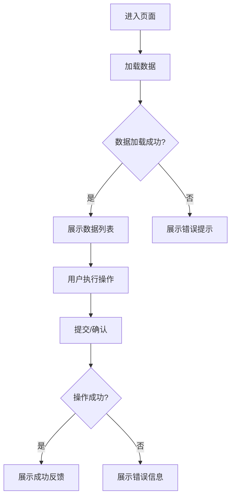
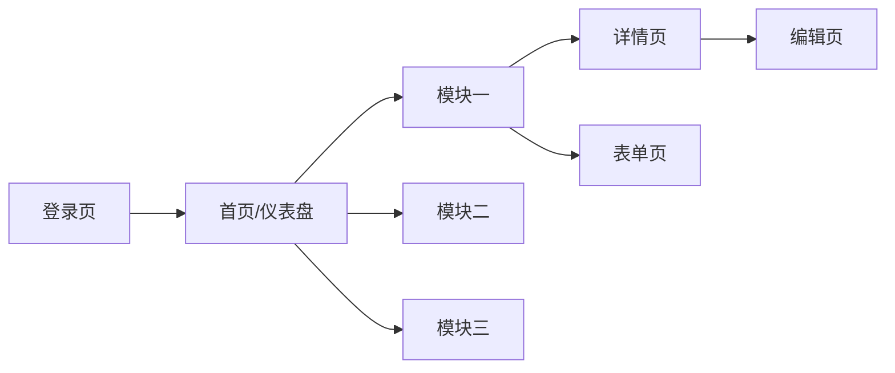

# {{项目名称}} — 原型设计文档

---

## 文档控制信息

| 属性       | 内容                        |
| ---------- | --------------------------- |
| 文档编号   | {{项目编号}}-PDD-001        |
| 文档版本   | {{文档版本}}                |
| 编写日期   | {{编写日期}}                |
| 作者       | {{作者姓名}}                |
| 审核人     | {{审核人}}                  |
| 批准人     | {{批准人}}                  |
| 原型工具   | {{原型工具名称}}（如 Figma / Axure / Sketch / 墨刀） |
| 原型链接   | {{在线原型访问地址}}        |
| 状态       | [待定]（草稿/评审中/已批准）|

### 版本变更记录

<!-- REPEAT_START -->
| 版本号 | 修改日期 | 修改人 | 修改内容摘要 |
| ------ | -------- | ------ | ------------ |
| {{版本号}} | {{修改日期}} | {{修改人}} | {{修改内容摘要}} |
<!-- REPEAT_END -->

---

## 1 设计概述

### 1.1 设计目标

<!-- AI_FILL: 阐述本次原型设计的目标，包括：验证核心业务流程的可行性、确认用户交互方式、对齐利益干系人的预期、为UI视觉设计提供基础结构等。 -->

### 1.2 设计原则

<!-- AI_FILL: 列出本次设计遵循的核心原则，例如：一致性、简洁性、可学习性、容错性、反馈及时性等。每条原则附简要说明。 -->

### 1.3 设计范围

| 范围类型 | 说明 |
| -------- | ---- |
| 本期覆盖 | {{本期需要完成原型的功能模块/页面列表}} |
| 本期不包含 | {{明确排除的功能或页面}} |
| 平台端   | [待定]（Web端 / 移动端H5 / 小程序 / App / 管理后台） |

### 1.4 设计依据

| 依据文档 | 版本 | 说明 |
| -------- | ---- | ---- |
| 需求规格说明书 | {{版本}} | 功能需求来源 |
| 竞品分析报告 | {{版本}} | 交互参考 |
| 品牌/UI规范 | {{版本}} | 视觉规范约束 |
<!-- REPEAT_START -->
| {{依据文档}} | {{版本}} | {{说明}} |
<!-- REPEAT_END -->

---

## 2 用户画像

<!-- AI_FILL: 基于需求分析阶段识别的用户角色，为每类核心用户构建用户画像，用于指导交互设计决策。 -->

<!-- REPEAT_START -->
### 2.X 用户画像：{{画像名称}}

| 属性     | 描述 |
| -------- | ---- |
| 姓名（虚构） | {{姓名}} |
| 年龄     | {{年龄范围}} |
| 职业/角色 | {{职业描述}} |
| 技术水平 | {{新手/普通/熟练/专家}} |
| 使用设备 | {{PC/手机/平板}} |
| 使用场景 | {{典型使用场景描述}} |
| 核心目标 | {{用户最想完成的任务}} |
| 痛点     | {{当前遇到的主要问题}} |
| 期望     | {{对产品的期望}} |
<!-- REPEAT_END -->

---

## 3 信息架构

### 3.1 系统功能结构图

<!-- AI_FILL: 以树形结构或层级列表呈现系统的整体功能架构，体现一级菜单、二级菜单及核心功能页面的组织关系。建议使用 Mermaid 图形或缩进列表。 -->

```mermaid
graph TD
    A[{{项目名称}}] --> B[模块一]
    A --> C[模块二]
    A --> D[模块三]
    B --> B1[功能页面1.1]
    B --> B2[功能页面1.2]
    C --> C1[功能页面2.1]
    C --> C2[功能页面2.2]
    D --> D1[功能页面3.1]
```

### 3.2 站点地图

<!-- AI_FILL: 以层级列表形式展示所有页面/屏幕的组织结构，标注页面间的层级关系和主要导航路径。 -->

### 3.3 全局导航设计

| 导航类型 | 位置 | 包含项目 | 说明 |
| -------- | ---- | -------- | ---- |
| 顶部导航栏 | 页面顶部 | {{导航项列表}} | {{说明}} |
| 侧边导航栏 | 页面左侧 | {{导航项列表}} | {{说明}} |
| 底部标签栏 | 页面底部（移动端） | {{标签项列表}} | {{说明}} |
| 面包屑导航 | 内容区顶部 | 自动生成 | 展示当前页面层级路径 |

---

## 4 页面/屏幕清单

<!-- AI_FILL: 列出系统中所有需要设计原型的页面或屏幕。 -->

<!-- REPEAT_START -->
| 页面编号 | 页面名称 | 所属模块 | 页面类型 | 优先级 | 对应需求编号 | 原型状态 |
| -------- | -------- | -------- | -------- | ------ | ------------ | -------- |
| {{页面编号}} | {{页面名称}} | {{所属模块}} | {{列表页/详情页/表单页/弹窗/仪表盘等}} | [待定] | {{需求编号}} | [待定]（未开始/进行中/已完成） |
<!-- REPEAT_END -->

---

## 5 页面详细设计

<!-- AI_FILL: 以下按页面逐一描述原型设计细节。每个页面独立成一小节。 -->

<!-- REPEAT_START -->
### 5.X 页面：{{页面名称}}（{{页面编号}}）

#### 5.X.1 页面概述

| 属性 | 内容 |
| ---- | ---- |
| 页面路径/URL | {{页面URL或路由}} |
| 页面用途 | {{页面的核心功能说明}} |
| 进入方式 | {{用户如何到达此页面}} |
| 关联需求 | {{对应的需求编号}} |
| 目标用户 | {{使用此页面的角色}} |

#### 5.X.2 页面布局

<!-- AI_FILL: 描述页面的整体布局结构，包括头部、侧边栏、主内容区、底部等区域的划分方式。可用文字描述或简化的 ASCII 布局图。 -->

```
+--------------------------------------------------+
|                    顶部导航栏                      |
+----------+---------------------------------------+
|          |                                       |
| 侧边菜单 |             主内容区                    |
|          |                                       |
|          |                                       |
+----------+---------------------------------------+
|                    底部信息栏                      |
+--------------------------------------------------+
```

#### 5.X.3 UI 元素清单

| 元素编号 | 元素名称 | 元素类型 | 默认状态 | 交互行为 | 数据来源 | 备注 |
| -------- | -------- | -------- | -------- | -------- | -------- | ---- |
| {{元素编号}} | {{元素名称}} | {{按钮/输入框/下拉框/表格/标签页/图表/卡片等}} | {{默认值或状态}} | {{点击/悬停/聚焦时的行为}} | {{静态/接口/计算}} | {{备注}} |

#### 5.X.4 交互流程

<!-- AI_FILL: 描述用户在此页面上的主要操作流程，包括正常流程和异常流程。可用步骤列表或流程图呈现。 -->



#### 5.X.5 数据展示要求

| 数据项 | 数据类型 | 展示格式 | 排序/筛选 | 为空时显示 |
| ------ | -------- | -------- | --------- | ---------- |
| {{数据项}} | {{文本/数字/日期/图片等}} | {{展示格式}} | {{是否支持排序筛选}} | {{缺省显示文案}} |

#### 5.X.6 表单校验规则

<!-- OPTIONAL_START -->
| 字段名 | 校验规则 | 错误提示 | 触发时机 |
| ------ | -------- | -------- | -------- |
| {{字段名}} | {{必填/长度/格式/范围等}} | {{错误提示文案}} | {{失焦/提交时}} |
<!-- OPTIONAL_END -->

#### 5.X.7 响应式设计

| 断点 | 布局调整说明 |
| ---- | ------------ |
| ≥ 1200px（桌面端） | {{布局描述}} |
| 768px ~ 1199px（平板端） | {{布局描述}} |
| ＜ 768px（移动端） | {{布局描述}} |
<!-- REPEAT_END -->

---

## 6 导航流程图

### 6.1 全局页面流转图

<!-- AI_FILL: 使用 Mermaid 或文字描述系统中主要页面之间的流转关系，展示用户在系统中的核心导航路径。 -->



### 6.2 核心业务流程

<!-- REPEAT_START -->
#### 业务流程：{{流程名称}}

<!-- AI_FILL: 用 Mermaid 流程图或步骤列表描述该核心业务从发起到完成的完整流程，标注每一步涉及的页面。 -->

```mermaid
flowchart TD
    S[开始] --> Step1[{{步骤1名称}}]
    Step1 --> Step2[{{步骤2名称}}]
    Step2 --> Decision{{{判断条件}}}
    Decision -->|条件A| Step3[{{步骤3名称}}]
    Decision -->|条件B| Step4[{{步骤4名称}}]
    Step3 --> E[结束]
    Step4 --> E
```
<!-- REPEAT_END -->

---

## 7 交互设计规范

### 7.1 全局交互规则

| 交互类型 | 规则描述 |
| -------- | -------- |
| 页面加载 | <!-- AI_FILL: 描述页面加载时的交互表现，如骨架屏、加载动画、渐进式加载等。 --> |
| 数据提交 | <!-- AI_FILL: 描述表单提交时的交互流程，如按钮loading状态、防重复提交、提交成功/失败反馈等。 --> |
| 列表操作 | <!-- AI_FILL: 描述列表的分页、滚动加载、批量操作、排序筛选等交互规则。 --> |
| 删除操作 | 所有删除操作必须弹出二次确认对话框，明确告知用户操作后果 |
| 表单填写 | 必填字段使用红色星号（*）标记，实时校验并在字段下方展示错误提示 |

### 7.2 反馈机制

| 反馈类型 | 使用场景 | 展示方式 | 持续时间 |
| -------- | -------- | -------- | -------- |
| 成功提示 | 操作成功后 | 顶部轻提示（Toast） | 2~3 秒自动消失 |
| 错误提示 | 操作失败时 | 顶部警告条或弹窗 | 手动关闭 |
| 加载状态 | 数据请求中 | 骨架屏或旋转加载图标 | 至请求完成 |
| 空状态   | 无数据时 | 居中插图 + 引导文案 | 持续展示 |
| 确认弹窗 | 重要操作前 | 模态对话框 | 等待用户选择 |
| 表单校验 | 输入不合规时 | 字段下方红色提示文字 | 至输入修正 |

### 7.3 错误处理规范

| 错误类型 | 处理方式 |
| -------- | -------- |
| 网络错误 | <!-- AI_FILL: 描述网络断开或请求超时时的界面表现和用户引导。 --> |
| 权限不足 | <!-- AI_FILL: 描述用户无权限访问时的界面表现和引导。 --> |
| 404 页面 | <!-- AI_FILL: 描述访问不存在页面时的界面设计和引导。 --> |
| 500 服务器错误 | <!-- AI_FILL: 描述服务端异常时的界面表现和重试机制。 --> |
| 表单校验失败 | 高亮错误字段，在字段下方展示具体错误原因，页面滚动至第一个错误字段 |

### 7.4 加载状态设计

| 加载场景 | 加载方式 | 说明 |
| -------- | -------- | ---- |
| 首次进入页面 | 骨架屏（Skeleton） | 展示页面结构占位，减少白屏感知 |
| 列表翻页/筛选 | 局部加载遮罩 | 仅覆盖列表区域，不阻塞其他操作 |
| 按钮操作 | 按钮 Loading 状态 | 按钮变为加载态，禁止重复点击 |
| 文件上传 | 进度条 | 展示上传百分比进度 |
| 下拉加载更多 | 底部加载指示器 | 滚动至底部自动触发 |

---

## 8 原型工具与资源

### 8.1 工具信息

| 项目 | 说明 |
| ---- | ---- |
| 原型工具 | {{工具名称及版本}} |
| 在线访问地址 | {{原型在线链接}} |
| 访问密码 | {{访问密码（如有）}} |
| 源文件位置 | {{原型源文件存储路径}} |

### 8.2 设计资源

| 资源名称 | 说明 | 位置 |
| -------- | ---- | ---- |
| 图标库 | {{使用的图标库名称}} | {{链接或路径}} |
| 组件库 | {{使用的组件库名称}} | {{链接或路径}} |
| 色彩规范 | {{主色/辅色/中性色定义}} | {{链接或路径}} |
| 字体规范 | {{字体/字号/行高定义}} | {{链接或路径}} |

<!-- OPTIONAL_START -->
### 8.3 组件复用说明

<!-- AI_FILL: 列出原型中复用的公共组件（如全局导航、页脚、搜索组件、分页组件等），说明其统一的交互规则和样式规范。 -->

<!-- REPEAT_START -->
| 组件名称 | 使用页面 | 交互规则 | 备注 |
| -------- | -------- | -------- | ---- |
| {{组件名称}} | {{使用该组件的页面列表}} | {{交互规则描述}} | {{备注}} |
<!-- REPEAT_END -->
<!-- OPTIONAL_END -->

---

## 9 评审反馈记录

### 9.1 评审信息

<!-- REPEAT_START -->
| 评审轮次 | 评审日期 | 评审人 | 评审方式 |
| -------- | -------- | ------ | -------- |
| {{第N轮}} | {{评审日期}} | {{评审人列表}} | {{线下会议/线上评审/异步评审}} |
<!-- REPEAT_END -->

### 9.2 评审问题清单

<!-- REPEAT_START -->
| 问题编号 | 所属页面 | 问题描述 | 提出人 | 提出日期 | 优先级 | 处理状态 | 处理方案 | 处理人 | 完成日期 |
| -------- | -------- | -------- | ------ | -------- | ------ | -------- | -------- | ------ | -------- |
| {{问题编号}} | {{页面编号/名称}} | {{问题描述}} | {{提出人}} | {{提出日期}} | [待定]（高/中/低） | [待定]（待处理/处理中/已解决/不处理） | {{处理方案}} | {{处理人}} | {{完成日期}} |
<!-- REPEAT_END -->

### 9.3 评审结论

<!-- REPEAT_START -->
| 评审轮次 | 评审结论 | 遗留问题数 | 下次评审计划 |
| -------- | -------- | ---------- | ------------ |
| {{第N轮}} | [待定]（通过/有条件通过/不通过） | {{遗留问题数}} | {{下次评审日期或"无需再次评审"}} |
<!-- REPEAT_END -->

---

## 附录

### 附录A：页面截图索引

<!-- AI_FILL: 如需在文档中嵌入原型截图，在此建立截图索引，方便查阅。 -->

<!-- REPEAT_START -->
| 截图编号 | 页面名称 | 截图说明 | 截图文件 |
| -------- | -------- | -------- | -------- |
| {{截图编号}} | {{页面名称}} | {{截图说明}} | {{截图文件路径或链接}} |
<!-- REPEAT_END -->

### 附录B：设计变更日志

<!-- REPEAT_START -->
| 变更编号 | 变更日期 | 涉及页面 | 变更内容 | 变更原因 | 变更人 |
| -------- | -------- | -------- | -------- | -------- | ------ |
| {{变更编号}} | {{变更日期}} | {{页面编号/名称}} | {{变更内容描述}} | {{变更原因}} | {{变更人}} |
<!-- REPEAT_END -->

### 附录C：术语表

| 术语 | 定义 |
| ---- | ---- |
| 骨架屏 | 页面加载时展示的灰色占位块，模拟页面结构 |
| Toast | 轻量级提示信息，短暂显示后自动消失 |
| 模态对话框 | 需用户主动操作后才能关闭的弹窗 |
<!-- REPEAT_START -->
| {{术语}} | {{定义}} |
<!-- REPEAT_END -->
