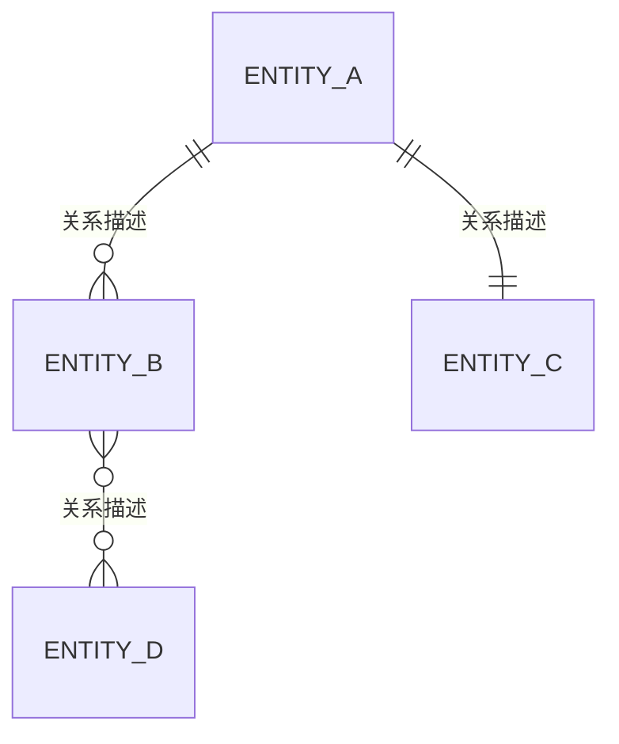

# 数据库设计文档

---

## 文档控制信息

| 属性     | 内容                        |
| -------- | --------------------------- |
| 项目名称 | {{项目名称}}                |
| 项目编号 | {{项目编号}}                |
| 文档编号 | {{文档编号}}                |
| 版本号   | {{版本号}}                  |
| 密级     | {{密级}}                    |
| 编制人   | {{编制人}}                  |
| 编制日期 | {{编制日期}}                |
| 审核人   | {{审核人}}                  |
| 审核日期 | {{审核日期}}                |
| 批准人   | {{批准人}}                  |
| 批准日期 | {{批准日期}}                |

### 变更历史

| 版本号 | 修改日期 | 修改人 | 修改内容摘要 | 审核人 |
| ------ | -------- | ------ | ------------ | ------ |
<!-- REPEAT_START -->
| {{版本号}} | {{修改日期}} | {{修改人}} | {{修改内容摘要}} | {{审核人}} |
<!-- REPEAT_END -->

---

## 1 设计概述

### 1.1 文档目的

本文档详细描述{{项目名称}}的数据库设计方案，包括概念模型、逻辑模型和物理模型，作为数据库开发和维护的指导依据。本文档面向数据库管理员（DBA）、后端开发人员和系统架构师。

### 1.2 设计目标

| 目标编号 | 设计目标 | 具体描述 | 度量标准 |
| -------- | -------- | -------- | -------- |
| DG-01 | 数据完整性 | 确保数据的准确性、一致性和完整性 | {{度量标准}} |
| DG-02 | 查询性能 | 满足业务场景的查询响应时间要求 | {{度量标准}} |
| DG-03 | 可扩展性 | 支持数据量和业务规模的增长 | {{度量标准}} |
| DG-04 | 安全性 | 保护敏感数据，防止未授权访问 | {{度量标准}} |
| DG-05 | 可维护性 | 结构清晰，便于后续维护和演进 | {{度量标准}} |
| DG-06 | 高可用性 | 确保数据库服务的持续可用 | {{度量标准}} |

### 1.3 数据库环境

| 环境属性 | 说明 |
| -------- | ---- |
| 数据库管理系统 | [待定] |
| 数据库版本 | {{版本号}} |
| 字符集 | {{如UTF-8/UTF8MB4}} |
| 排序规则 | {{如utf8mb4_general_ci}} |
| 存储引擎 | {{如InnoDB}} |
| 操作系统 | {{操作系统}} |
| 部署方式 | [待定]（如：主从复制/集群/云数据库） |

### 1.4 命名规范

#### 1.4.1 通用规则

- 所有名称统一使用小写字母和下划线组合（snake_case）
- 名称应具有业务含义，避免使用无意义缩写
- 避免使用数据库保留关键字
- 名称长度不超过{{最大长度}}个字符

#### 1.4.2 具体命名规范

| 对象类型 | 命名规则 | 前缀/后缀 | 示例 |
| -------- | -------- | ---------- | ---- |
| 数据库名 | {{命名规则}} | {{前缀}} | {{示例}} |
| 表名 | {{命名规则}} | {{前缀}} | {{示例}} |
| 字段名 | {{命名规则}} | — | {{示例}} |
| 主键 | {{命名规则}} | {{如pk_}} | {{示例}} |
| 外键 | {{命名规则}} | {{如fk_}} | {{示例}} |
| 索引 | {{命名规则}} | {{如idx_/uniq_}} | {{示例}} |
| 视图 | {{命名规则}} | {{如v_/view_}} | {{示例}} |
| 存储过程 | {{命名规则}} | {{如sp_/proc_}} | {{示例}} |
| 函数 | {{命名规则}} | {{如fn_/func_}} | {{示例}} |
| 触发器 | {{命名规则}} | {{如trg_}} | {{示例}} |
| 序列 | {{命名规则}} | {{如seq_}} | {{示例}} |

### 1.5 设计原则

| 原则编号 | 原则名称 | 原则描述 |
| -------- | -------- | -------- |
| DP-01 | 规范化原则 | 遵循第三范式（3NF），必要时适当反规范化以优化查询性能 |
| DP-02 | 主键设计 | {{主键设计原则，如使用自增ID/UUID/雪花算法等}} |
| DP-03 | 公共字段 | 每张业务表包含统一的公共字段（创建人、创建时间、更新人、更新时间等） |
| DP-04 | 软删除 | {{软删除策略，如使用is_deleted标志位/deleted_at时间戳}} |
| DP-05 | 字段可空性 | 业务必填字段设置NOT NULL约束，可选字段允许为NULL |
| DP-06 | 字段类型选择 | 选择合适的字段类型，避免过度分配存储空间 |
| DP-07 | 索引策略 | 根据查询模式创建合适索引，避免过度索引 |
| DP-08 | 外键策略 | [待定]（如：使用物理外键/仅逻辑外键/混合策略） |

### 1.6 公共字段定义

以下公共字段应包含在所有业务表中：

| 字段名 | 数据类型 | 长度 | 可空 | 默认值 | 说明 |
| ------ | -------- | ---- | ---- | ------ | ---- |
| id | {{数据类型}} | {{长度}} | 否 | {{默认值}} | 主键标识 |
| created_by | {{数据类型}} | {{长度}} | 是 | NULL | 创建人 |
| created_at | {{数据类型}} | — | 否 | CURRENT_TIMESTAMP | 创建时间 |
| updated_by | {{数据类型}} | {{长度}} | 是 | NULL | 最后修改人 |
| updated_at | {{数据类型}} | — | 否 | CURRENT_TIMESTAMP | 最后修改时间 |
| is_deleted | {{数据类型}} | — | 否 | 0 | 逻辑删除标志（0=正常，1=已删除） |
| remark | VARCHAR | {{长度}} | 是 | NULL | 备注 |

---

## 2 概念数据模型

### 2.1 ER图描述

<!-- AI_FILL: 以文字详细描述系统的实体关系图（ER图），标明所有核心实体及其之间的关系类型（一对一、一对多、多对多），可使用Mermaid ER图语法 -->



### 2.2 核心实体概述

| 实体编号 | 实体名称 | 实体中文名 | 实体描述 | 预估数据量 | 增长率 |
| -------- | -------- | ---------- | -------- | ---------- | ------ |
<!-- REPEAT_START -->
| {{实体编号}} | {{实体名称}} | {{实体中文名}} | {{实体描述}} | {{预估数据量}} | {{年增长率}} |
<!-- REPEAT_END -->

### 2.3 实体关系列表

| 关系编号 | 实体A | 关系类型 | 实体B | 关系描述 | 业务规则 |
| -------- | ----- | -------- | ----- | -------- | -------- |
<!-- REPEAT_START -->
| {{关系编号}} | {{实体A}} | {{1:1 / 1:N / M:N}} | {{实体B}} | {{关系描述}} | {{业务规则}} |
<!-- REPEAT_END -->

---

## 3 逻辑数据模型

### 3.1 实体详细定义

<!-- REPEAT_START -->
#### 3.1.X {{实体中文名}}（{{实体名称}}）

**实体描述：** {{实体详细描述}}

**属性列表：**

| 属性编号 | 属性名称 | 中文名 | 数据类型 | 是否主键 | 是否外键 | 是否必填 | 业务规则 |
| -------- | -------- | ------ | -------- | -------- | -------- | -------- | -------- |
| {{属性编号}} | {{属性名称}} | {{中文名}} | {{数据类型}} | {{是/否}} | {{是/否}} | {{是/否}} | {{业务规则}} |

**唯一约束：**

| 约束名称 | 包含属性 | 说明 |
| -------- | -------- | ---- |
| {{约束名称}} | {{属性列表}} | {{说明}} |

**业务规则：**

<!-- AI_FILL: 描述与该实体相关的核心业务规则和数据校验逻辑 -->

<!-- REPEAT_END -->

### 3.2 实体关系详细描述

<!-- REPEAT_START -->
#### 关系：{{实体A}} — {{实体B}}

| 属性 | 说明 |
| ---- | ---- |
| 关系类型 | {{1:1 / 1:N / M:N}} |
| 关系方向 | {{实体A → 实体B的描述}} |
| 参与度（实体A端） | {{强制/可选}} |
| 参与度（实体B端） | {{强制/可选}} |
| 级联规则 | {{级联删除/级联更新/限制删除/置空}} |
| 业务含义 | {{业务含义描述}} |

<!-- AI_FILL: 补充关系的详细业务场景说明 -->

<!-- REPEAT_END -->

---

## 4 物理数据模型

### 4.1 表设计

<!-- REPEAT_START -->
#### 4.1.X {{表中文名}}（{{表名}}）

**表说明：**

| 属性 | 说明 |
| ---- | ---- |
| 表名 | {{表名}} |
| 中文名 | {{表中文名}} |
| 所属模块 | {{所属模块}} |
| 存储引擎 | {{存储引擎}} |
| 字符集 | {{字符集}} |
| 表描述 | {{表描述}} |
| 预估数据量 | {{预估数据量}} |
| 分区策略 | {{分区策略，如无则填"无"}} |

**字段定义：**

| 序号 | 字段名 | 中文名 | 数据类型 | 长度/精度 | 可空 | 默认值 | 说明 |
| ---- | ------ | ------ | -------- | --------- | ---- | ------ | ---- |
| 1 | id | 主键 | {{数据类型}} | {{长度}} | 否 | {{默认值}} | 主键标识 |
<!-- REPEAT_START -->
| {{序号}} | {{字段名}} | {{中文名}} | {{数据类型}} | {{长度/精度}} | {{是/否}} | {{默认值}} | {{说明}} |
<!-- REPEAT_END -->
| | created_by | 创建人 | {{数据类型}} | {{长度}} | 是 | NULL | 创建人 |
| | created_at | 创建时间 | DATETIME | — | 否 | CURRENT_TIMESTAMP | 记录创建时间 |
| | updated_by | 修改人 | {{数据类型}} | {{长度}} | 是 | NULL | 最后修改人 |
| | updated_at | 修改时间 | DATETIME | — | 否 | CURRENT_TIMESTAMP | 记录修改时间 |
| | is_deleted | 删除标志 | TINYINT | 1 | 否 | 0 | 逻辑删除（0=正常，1=删除） |

**主键：**

| 主键名称 | 包含字段 | 说明 |
| -------- | -------- | ---- |
| {{主键名称}} | {{字段列表}} | {{说明}} |

**索引设计：**

| 索引名称 | 索引类型 | 包含字段 | 索引顺序 | 用途说明 |
| -------- | -------- | -------- | -------- | -------- |
<!-- REPEAT_START -->
| {{索引名称}} | {{普通索引/唯一索引/组合索引/全文索引}} | {{字段列表}} | {{ASC/DESC}} | {{用途说明}} |
<!-- REPEAT_END -->

**约束定义：**

| 约束名称 | 约束类型 | 包含字段 | 约束规则 | 说明 |
| -------- | -------- | -------- | -------- | ---- |
<!-- REPEAT_START -->
| {{约束名称}} | {{主键/外键/唯一/检查/非空}} | {{字段列表}} | {{约束表达式}} | {{说明}} |
<!-- REPEAT_END -->

**建表DDL参考：**

```sql
CREATE TABLE {{表名}} (
    -- 请根据上述字段定义生成DDL
    -- AI_FILL: 生成完整的建表SQL语句
) ENGINE={{存储引擎}} DEFAULT CHARSET={{字符集}} COMMENT='{{表中文名}}';
```

<!-- REPEAT_END -->

### 4.2 索引设计策略

#### 4.2.1 索引设计原则

| 原则编号 | 原则内容 | 说明 |
| -------- | -------- | ---- |
| IX-01 | 针对高频查询条件创建索引 | {{说明}} |
| IX-02 | 组合索引遵循最左前缀原则 | {{说明}} |
| IX-03 | 避免在频繁更新的字段上创建过多索引 | {{说明}} |
| IX-04 | 避免索引冗余 | {{说明}} |
| IX-05 | 大表考虑覆盖索引减少回表 | {{说明}} |
| IX-06 | 单表索引数量不超过{{最大数量}}个 | {{说明}} |
| IX-07 | 组合索引字段数不超过{{最大数量}}个 | {{说明}} |

#### 4.2.2 索引汇总

| 表名 | 索引名称 | 索引类型 | 索引字段 | 关联查询场景 |
| ---- | -------- | -------- | -------- | ------------ |
<!-- REPEAT_START -->
| {{表名}} | {{索引名称}} | {{索引类型}} | {{索引字段}} | {{查询场景描述}} |
<!-- REPEAT_END -->

<!-- OPTIONAL_START -->
### 4.3 分区策略

#### 4.3.1 需要分区的表

| 表名 | 分区方式 | 分区键 | 分区规则 | 预计分区数 | 说明 |
| ---- | -------- | ------ | -------- | ---------- | ---- |
<!-- REPEAT_START -->
| {{表名}} | {{RANGE/LIST/HASH/KEY}} | {{分区键}} | {{分区规则描述}} | {{预计分区数}} | {{说明}} |
<!-- REPEAT_END -->

#### 4.3.2 分区管理策略

<!-- AI_FILL: 描述分区的创建、合并、删除策略，以及自动分区管理方案（如按月自动创建新分区） -->

<!-- OPTIONAL_END -->

---

## 5 数据字典

### 5.1 枚举值/码表定义

<!-- REPEAT_START -->
#### 5.1.X {{字典名称}}

| 属性 | 说明 |
| ---- | ---- |
| 字典编码 | {{字典编码}} |
| 字典名称 | {{字典名称}} |
| 适用范围 | {{适用的表和字段}} |

| 编码值 | 显示值 | 说明 | 排序 | 是否启用 |
| ------ | ------ | ---- | ---- | -------- |
<!-- REPEAT_START -->
| {{编码值}} | {{显示值}} | {{说明}} | {{排序号}} | {{是/否}} |
<!-- REPEAT_END -->

<!-- REPEAT_END -->

### 5.2 表字段字典总览

<!-- AI_FILL: 如果项目需要更集中的数据字典视图，可以在此生成按表分组的完整字段字典 -->

---

## 6 视图设计

| 视图名称 | 中文名 | 视图用途 | 关联基表 | 更新频率 |
| -------- | ------ | -------- | -------- | -------- |
<!-- REPEAT_START -->
| {{视图名称}} | {{中文名}} | {{视图用途}} | {{关联的基表列表}} | {{实时/定期刷新}} |
<!-- REPEAT_END -->

<!-- REPEAT_START -->
### 视图：{{视图名称}}（{{中文名}}）

**视图描述：** {{视图详细描述}}

**视图DDL参考：**

```sql
CREATE VIEW {{视图名称}} AS
-- AI_FILL: 根据视图用途生成视图查询SQL
SELECT ...
FROM ...
WHERE ...;
```

**使用场景：**

<!-- AI_FILL: 描述该视图的典型使用场景 -->

<!-- REPEAT_END -->

---

<!-- OPTIONAL_START -->
## 7 存储过程与函数设计

### 7.1 存储过程列表

| 存储过程名称 | 中文名 | 用途 | 输入参数 | 输出参数 | 调用频率 |
| ------------ | ------ | ---- | -------- | -------- | -------- |
<!-- REPEAT_START -->
| {{存储过程名称}} | {{中文名}} | {{用途}} | {{输入参数列表}} | {{输出参数列表}} | {{调用频率}} |
<!-- REPEAT_END -->

<!-- REPEAT_START -->
### 存储过程：{{存储过程名称}}

**用途：** {{存储过程用途描述}}

**参数定义：**

| 参数名 | 方向 | 数据类型 | 说明 |
| ------ | ---- | -------- | ---- |
<!-- REPEAT_START -->
| {{参数名}} | {{IN/OUT/INOUT}} | {{数据类型}} | {{说明}} |
<!-- REPEAT_END -->

**处理逻辑：**

<!-- AI_FILL: 描述存储过程的处理逻辑步骤 -->

**DDL参考：**

```sql
DELIMITER $$
CREATE PROCEDURE {{存储过程名称}}(
    -- AI_FILL: 根据参数定义生成参数声明
)
BEGIN
    -- AI_FILL: 根据处理逻辑生成存储过程SQL
END$$
DELIMITER ;
```

<!-- REPEAT_END -->

### 7.2 函数列表

| 函数名称 | 中文名 | 用途 | 输入参数 | 返回类型 |
| -------- | ------ | ---- | -------- | -------- |
<!-- REPEAT_START -->
| {{函数名称}} | {{中文名}} | {{用途}} | {{输入参数列表}} | {{返回数据类型}} |
<!-- REPEAT_END -->

<!-- OPTIONAL_END -->

---

<!-- OPTIONAL_START -->
## 8 数据迁移方案

### 8.1 迁移概述

| 属性 | 说明 |
| ---- | ---- |
| 迁移源系统 | {{源系统名称}} |
| 迁移源数据库 | {{源数据库类型和版本}} |
| 迁移数据量 | {{预估数据量}} |
| 迁移策略 | [待定]（如：全量迁移/增量迁移/混合迁移） |
| 计划迁移窗口 | {{迁移时间窗口}} |
| 回滚方案 | {{回滚方案描述}} |

### 8.2 数据映射关系

| 源表名 | 源字段 | 目标表名 | 目标字段 | 转换规则 | 备注 |
| ------ | ------ | -------- | -------- | -------- | ---- |
<!-- REPEAT_START -->
| {{源表名}} | {{源字段}} | {{目标表名}} | {{目标字段}} | {{转换规则描述}} | {{备注}} |
<!-- REPEAT_END -->

### 8.3 迁移步骤

<!-- AI_FILL: 描述完整的数据迁移步骤，包括准备、执行、验证、切换各阶段的详细操作 -->

### 8.4 数据验证方案

| 验证维度 | 验证方法 | 验证标准 | 验证工具 |
| -------- | -------- | -------- | -------- |
| 数据量验证 | {{方法}} | 源目标记录数一致 | {{工具}} |
| 数据完整性验证 | {{方法}} | {{验证标准}} | {{工具}} |
| 数据准确性验证 | {{方法}} | {{验证标准}} | {{工具}} |
| 业务逻辑验证 | {{方法}} | {{验证标准}} | {{工具}} |

<!-- OPTIONAL_END -->

---

## 9 备份与恢复策略

### 9.1 备份策略

| 备份类型 | 备份方式 | 备份频率 | 备份时间窗口 | 保留周期 | 存储位置 |
| -------- | -------- | -------- | ------------ | -------- | -------- |
| 全量备份 | {{备份方式}} | {{如每周一次}} | {{备份时间}} | {{保留周期}} | {{存储位置}} |
| 增量备份 | {{备份方式}} | {{如每日一次}} | {{备份时间}} | {{保留周期}} | {{存储位置}} |
| Binlog备份 | {{备份方式}} | {{实时}} | — | {{保留周期}} | {{存储位置}} |

### 9.2 恢复策略

| 恢复场景 | 恢复方式 | 预计恢复时间(RTO) | 数据丢失容忍度(RPO) | 恢复步骤 |
| -------- | -------- | ------------------ | -------------------- | -------- |
| 误操作恢复 | {{恢复方式}} | {{RTO}} | {{RPO}} | {{恢复步骤概述}} |
| 硬件故障恢复 | {{恢复方式}} | {{RTO}} | {{RPO}} | {{恢复步骤概述}} |
| 灾难恢复 | {{恢复方式}} | {{RTO}} | {{RPO}} | {{恢复步骤概述}} |

### 9.3 备份验证

| 验证项目 | 验证频率 | 验证方法 | 负责人 |
| -------- | -------- | -------- | ------ |
| 备份完整性检查 | {{频率}} | {{方法}} | {{负责人}} |
| 恢复演练 | {{频率}} | {{方法}} | {{负责人}} |
| 异地备份验证 | {{频率}} | {{方法}} | {{负责人}} |

---

## 10 性能优化策略

### 10.1 SQL编写规范

| 规范编号 | 规范内容 | 说明 |
| -------- | -------- | ---- |
| SQ-01 | 禁止使用 SELECT * | 明确指定需要的字段 |
| SQ-02 | 避免在WHERE子句中对字段进行函数操作 | 会导致索引失效 |
| SQ-03 | 使用LIMIT限制返回行数 | 尤其是分页查询场景 |
| SQ-04 | 避免大事务操作 | 事务时间不超过{{最大秒数}}秒 |
| SQ-05 | JOIN表数量不超过{{最大数量}}张 | 减少查询复杂度 |
| SQ-06 | 批量操作使用批量SQL | 避免逐行操作 |
| SQ-07 | 合理使用索引提示 | 仅在优化器选择不当时使用 |
| SQ-08 | IN子句元素数量不超过{{最大数量}}个 | 超出时改用临时表JOIN |

### 10.2 查询优化策略

| 优化场景 | 优化策略 | 适用条件 | 预期效果 |
| -------- | -------- | -------- | -------- |
| 大表查询 | {{优化策略}} | {{适用条件}} | {{预期效果}} |
| 多表关联 | {{优化策略}} | {{适用条件}} | {{预期效果}} |
| 聚合统计 | {{优化策略}} | {{适用条件}} | {{预期效果}} |
| 模糊查询 | {{优化策略}} | {{适用条件}} | {{预期效果}} |
| 分页查询 | {{优化策略}} | {{适用条件}} | {{预期效果}} |

<!-- AI_FILL: 针对系统的核心业务场景，提供具体的查询优化建议 -->

### 10.3 数据库参数优化

| 参数名称 | 建议值 | 默认值 | 说明 |
| -------- | ------ | ------ | ---- |
<!-- REPEAT_START -->
| {{参数名称}} | {{建议值}} | {{默认值}} | {{参数说明}} |
<!-- REPEAT_END -->

### 10.4 慢查询监控

| 配置项 | 配置值 | 说明 |
| ------ | ------ | ---- |
| 慢查询阈值 | {{如2秒}} | 超过此时间的查询记录到慢查询日志 |
| 慢查询日志位置 | {{日志路径}} | 慢查询日志文件存储位置 |
| 定期分析频率 | {{如每周}} | 定期分析慢查询日志并优化 |
| 告警阈值 | {{如慢查询数>100/小时}} | 超过此阈值触发告警 |

---

## 11 数据库Schema版本控制

### 11.1 版本控制策略

| 属性 | 说明 |
| ---- | ---- |
| 版本控制工具 | [待定]（如：Flyway / Liquibase / 手动管理） |
| 脚本存放路径 | {{脚本存放路径}} |
| 脚本命名规范 | {{如V{版本号}__{描述}.sql}} |
| 执行环境顺序 | 开发 → 测试 → 预发布 → 生产 |
| 回滚策略 | {{回滚策略描述}} |

### 11.2 变更管理流程

```
变更申请 → DBA审核 → 测试环境验证 → 预发布环境验证 → 生产环境执行 → 验证确认
```

<!-- AI_FILL: 详细描述数据库变更管理的完整流程，包括各角色职责、审批节点、紧急变更流程 -->

### 11.3 变更记录模板

| 变更编号 | 变更日期 | 变更类型 | 变更描述 | 影响的表 | 执行人 | 审核人 | 回滚脚本 |
| -------- | -------- | -------- | -------- | -------- | ------ | ------ | -------- |
<!-- REPEAT_START -->
| {{变更编号}} | {{变更日期}} | {{DDL/DML/配置}} | {{变更描述}} | {{影响的表}} | {{执行人}} | {{审核人}} | {{回滚脚本路径}} |
<!-- REPEAT_END -->

---

## 附录

### 附录A 表清单汇总

| 序号 | 表名 | 中文名 | 所属模块 | 预估数据量 | 说明 |
| ---- | ---- | ------ | -------- | ---------- | ---- |
<!-- REPEAT_START -->
| {{序号}} | {{表名}} | {{中文名}} | {{所属模块}} | {{预估数据量}} | {{说明}} |
<!-- REPEAT_END -->

### 附录B 索引清单汇总

| 序号 | 表名 | 索引名称 | 索引类型 | 索引字段 | 说明 |
| ---- | ---- | -------- | -------- | -------- | ---- |
<!-- REPEAT_START -->
| {{序号}} | {{表名}} | {{索引名称}} | {{索引类型}} | {{索引字段}} | {{说明}} |
<!-- REPEAT_END -->

### 附录C 常用查询SQL参考

<!-- AI_FILL: 提供系统常用业务场景的SQL查询示例，供开发人员参考 -->

### 附录D 数据库权限分配

| 数据库账号 | 权限类型 | 权限范围 | 适用环境 | 说明 |
| ---------- | -------- | -------- | -------- | ---- |
<!-- REPEAT_START -->
| {{账号名称}} | {{只读/读写/管理员}} | {{库/表/字段级别}} | {{开发/测试/生产}} | {{说明}} |
<!-- REPEAT_END -->

### 附录E 术语表

| 术语 | 定义 |
| ---- | ---- |
<!-- REPEAT_START -->
| {{术语}} | {{定义}} |
<!-- REPEAT_END -->

---

> **文档结束**
>
> 本文档为{{项目名称}}数据库设计文档，版本{{版本号}}。
