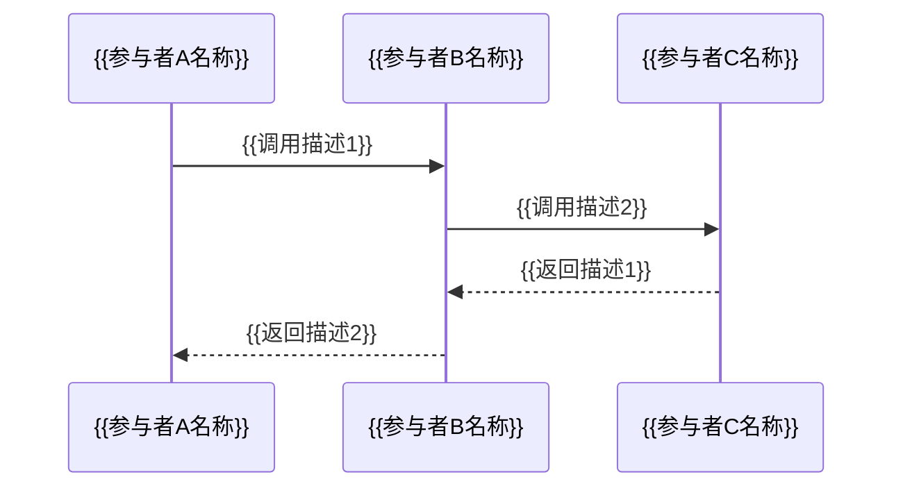

# {{项目名称}} 详细设计说明书

---

## 文档控制信息

| 属性       | 内容                |
| ---------- | ------------------- |
| 文档编号   | {{项目编号}}-DD-001 |
| 文档名称   | 详细设计说明书      |
| 版本号     | {{版本号}}          |
| 密级       | [待定]              |
| 项目名称   | {{项目名称}}        |
| 项目编号   | {{项目编号}}        |
| 编写人     | {{编写人}}          |
| 编写日期   | {{编写日期}}        |
| 审核人     | {{审核人}}          |
| 审核日期   | {{审核日期}}        |
| 批准人     | {{批准人}}          |
| 批准日期   | {{批准日期}}        |

### 变更记录

| 版本号 | 修改日期     | 修改人     | 修改内容描述           | 审核人     |
| ------ | ------------ | ---------- | ---------------------- | ---------- |
| V1.0   | {{编写日期}} | {{编写人}} | 初始版本               | {{审核人}} |
<!-- REPEAT_START -->
| {{版本号}} | {{修改日期}} | {{修改人}} | {{修改内容描述}} | {{审核人}} |
<!-- REPEAT_END -->

---

## 目录

1. [引言](#1-引言)
2. [设计概述](#2-设计概述)
3. [模块详细设计](#3-模块详细设计)
4. [数据库访问设计](#4-数据库访问设计)
5. [公共工具类设计](#5-公共工具类设计)
6. [配置管理设计](#6-配置管理设计)
7. [日志设计](#7-日志设计)
8. [定时任务设计](#8-定时任务设计)
9. [设计评审检查清单](#9-设计评审检查清单)

---

## 1. 引言

### 1.1 编写目的

本文档是{{项目名称}}项目的详细设计说明书，旨在对系统概要设计中确定的各功能模块进行详细的设计描述。本文档将作为编码实现、单元测试和代码评审的直接依据。

<!-- AI_FILL: 根据具体项目背景，补充本文档的预期读者群体和使用场景说明 -->

### 1.2 项目范围

- **项目名称**：{{项目名称}}
- **项目背景**：{{项目背景描述}}
- **系统边界**：<!-- AI_FILL: 根据概要设计，描述本次详细设计所覆盖的系统边界和子系统范围 -->

### 1.3 术语和缩写

| 术语/缩写 | 全称       | 说明                     |
| ---------- | ---------- | ------------------------ |
<!-- REPEAT_START -->
| {{术语}}   | {{全称}}   | {{说明}}                 |
<!-- REPEAT_END -->

### 1.4 参考文档

| 文档编号         | 文档名称             | 版本号     | 说明         |
| ---------------- | -------------------- | ---------- | ------------ |
| {{参考文档编号}} | {{参考文档名称}}     | {{版本号}} | {{说明}}     |
<!-- REPEAT_START -->
| {{参考文档编号}} | {{参考文档名称}}     | {{版本号}} | {{说明}}     |
<!-- REPEAT_END -->

---

## 2. 设计概述

### 2.1 设计目标

<!-- AI_FILL: 根据概要设计和需求规格说明书，归纳本次详细设计需要达成的核心设计目标，包括功能实现完整性、代码质量要求、性能指标等 -->

- **功能完整性**：{{功能完整性目标}}
- **代码质量**：{{代码质量目标}}
- **可维护性**：{{可维护性目标}}
- **可测试性**：{{可测试性目标}}

### 2.2 设计约束

| 约束类别     | 约束内容                 | 影响范围         | 应对策略         |
| ------------ | ------------------------ | ---------------- | ---------------- |
| 技术约束     | {{技术约束描述}}         | {{影响范围}}     | {{应对策略}}     |
| 性能约束     | {{性能约束描述}}         | {{影响范围}}     | {{应对策略}}     |
| 安全约束     | {{安全约束描述}}         | {{影响范围}}     | {{应对策略}}     |
| 兼容性约束   | {{兼容性约束描述}}       | {{影响范围}}     | {{应对策略}}     |
<!-- REPEAT_START -->
| {{约束类别}} | {{约束内容}}             | {{影响范围}}     | {{应对策略}}     |
<!-- REPEAT_END -->

### 2.3 设计方法

- **设计模式**：<!-- AI_FILL: 列出本项目中计划采用的主要设计模式（如工厂模式、策略模式、观察者模式等）并简述其应用场景 -->
- **架构风格**：{{架构风格描述}}
- **编码规范**：{{编码规范引用}}
- **分层策略**：<!-- AI_FILL: 描述各代码层次（Controller/Service/Repository/Model等）的职责划分和调用规则 -->

### 2.4 技术选型总览

| 技术领域     | 技术选型             | 版本       | 用途说明             |
| ------------ | -------------------- | ---------- | -------------------- |
<!-- REPEAT_START -->
| {{技术领域}} | {{技术名称}}         | {{版本}}   | {{用途说明}}         |
<!-- REPEAT_END -->

---

## 3. 模块详细设计

<!-- AI_FILL: 根据概要设计中的模块划分，为每个模块生成一个独立的子章节。以下为每个模块的标准模板。 -->

<!-- REPEAT_START -->

### 3.x {{模块名称}} 详细设计

#### 3.x.1 基本信息

| 属性           | 内容                     |
| -------------- | ------------------------ |
| 模块ID         | {{模块ID}}               |
| 模块名称       | {{模块名称}}             |
| 所属子系统     | {{所属子系统}}           |
| 模块负责人     | {{模块负责人}}           |
| 概要设计章节   | {{概要设计对应章节号}}   |

#### 3.x.2 模块描述与职责

**模块描述**：

<!-- AI_FILL: 根据概要设计中该模块的功能定义，详细描述模块的业务功能、在系统中的角色及主要输入输出 -->

**核心职责**：

- {{职责1}}
- {{职责2}}
- {{职责3}}

**模块边界**：

- **负责范围**：{{模块负责范围说明}}
- **不负责范围**：{{模块不负责的范围说明}}

#### 3.x.3 类设计

##### 3.x.3.1 类图描述

<!-- AI_FILL: 用文字描述该模块中所有核心类的关系图，包括继承、实现、组合、依赖等关系。可使用Mermaid语法绘制类图。 -->

```mermaid
classDiagram
    class {{类名A}} {
        <<{{类型标注}}>>
        -{{属性类型}} {{属性名}}
        +{{返回类型}} {{方法名}}({{参数列表}})
    }
    class {{类名B}} {
        -{{属性类型}} {{属性名}}
        +{{返回类型}} {{方法名}}({{参数列表}})
    }
    {{类名A}} --> {{类名B}} : {{关系描述}}
```

##### 3.x.3.2 类详细定义

**类名**：`{{类全限定名}}`

| 属性     | 说明                     |
| -------- | ------------------------ |
| 类型     | [待定] （类/接口/枚举/抽象类） |
| 包路径   | {{包路径}}               |
| 继承     | {{父类名称}}             |
| 实现接口 | {{接口列表}}             |
| 设计模式 | {{所用设计模式}}         |
| 线程安全 | [待定] （是/否）         |

**属性列表**：

| 属性名       | 数据类型     | 访问级别 | 默认值   | 说明             | 约束条件         |
| ------------ | ------------ | -------- | -------- | ---------------- | ---------------- |
<!-- REPEAT_START -->
| {{属性名}}   | {{数据类型}} | {{访问级别}} | {{默认值}} | {{说明}}     | {{约束条件}}     |
<!-- REPEAT_END -->

**方法列表**：

| 方法名       | 返回类型     | 访问级别 | 参数列表         | 说明             | 异常             |
| ------------ | ------------ | -------- | ---------------- | ---------------- | ---------------- |
<!-- REPEAT_START -->
| {{方法名}}   | {{返回类型}} | {{访问级别}} | {{参数列表}} | {{说明}}     | {{异常列表}}     |
<!-- REPEAT_END -->

**方法详细说明**：

<!-- REPEAT_START -->
##### 方法：`{{方法名}}({{参数列表}})`

- **功能描述**：{{方法功能描述}}
- **前置条件**：{{前置条件}}
- **后置条件**：{{后置条件}}
- **参数说明**：

| 参数名   | 类型     | 必填 | 说明     | 取值范围     |
| -------- | -------- | ---- | -------- | ------------ |
| {{参数名}} | {{类型}} | {{是/否}} | {{说明}} | {{取值范围}} |

- **返回值说明**：{{返回值说明}}
- **异常处理**：

| 异常类型     | 触发条件         | 处理方式         |
| ------------ | ---------------- | ---------------- |
| {{异常类型}} | {{触发条件}}     | {{处理方式}}     |

<!-- REPEAT_END -->

#### 3.x.4 交互与时序

<!-- AI_FILL: 针对该模块的核心业务流程，用Mermaid时序图或文字描述各对象之间的调用顺序和交互逻辑 -->



**交互流程说明**：

1. {{步骤1说明}}
2. {{步骤2说明}}
3. {{步骤3说明}}

#### 3.x.5 算法描述

<!-- AI_FILL: 描述模块中涉及的关键算法、业务计算逻辑，可使用伪代码或流程图表达 -->

**算法名称**：{{算法名称}}

**算法目的**：{{算法目的描述}}

**算法复杂度**：时间复杂度 {{时间复杂度}}，空间复杂度 {{空间复杂度}}

**伪代码**：

```
函数 {{函数名}}({{输入参数}})：
    // {{步骤注释}}
    {{伪代码逻辑}}
    返回 {{返回值}}
结束函数
```

**流程图**：

```mermaid
flowchart TD
    A[开始] --> B{{{判断条件}}}
    B -->|是| C[{{处理步骤1}}]
    B -->|否| D[{{处理步骤2}}]
    C --> E[结束]
    D --> E
```

#### 3.x.6 状态机描述

<!-- OPTIONAL_START -->

**适用场景**：{{状态机应用场景说明}}

**状态定义**：

| 状态编码     | 状态名称     | 说明             | 允许操作         |
| ------------ | ------------ | ---------------- | ---------------- |
<!-- REPEAT_START -->
| {{状态编码}} | {{状态名称}} | {{说明}}         | {{允许操作列表}} |
<!-- REPEAT_END -->

**状态迁移规则**：

| 当前状态     | 触发事件     | 目标状态     | 守卫条件         | 动作             |
| ------------ | ------------ | ------------ | ---------------- | ---------------- |
<!-- REPEAT_START -->
| {{当前状态}} | {{触发事件}} | {{目标状态}} | {{守卫条件}}     | {{动作描述}}     |
<!-- REPEAT_END -->

**状态图**：

```mermaid
stateDiagram-v2
    [*] --> {{初始状态}}
    {{初始状态}} --> {{状态B}}: {{事件1}}
    {{状态B}} --> {{状态C}}: {{事件2}}
    {{状态C}} --> [*]: {{结束事件}}
```

<!-- OPTIONAL_END -->

#### 3.x.7 错误处理逻辑

| 错误场景         | 错误码       | 错误描述         | 处理策略         | 重试机制     | 日志级别 |
| ---------------- | ------------ | ---------------- | ---------------- | ------------ | -------- |
<!-- REPEAT_START -->
| {{错误场景}}     | {{错误码}}   | {{错误描述}}     | {{处理策略}}     | {{重试机制}} | {{日志级别}} |
<!-- REPEAT_END -->

**全局异常处理规则**：

<!-- AI_FILL: 描述该模块的全局异常捕获策略、异常转换规则和异常传播机制 -->

#### 3.x.8 性能考虑

| 性能指标         | 目标值       | 优化策略             | 测量方法             |
| ---------------- | ------------ | -------------------- | -------------------- |
| 响应时间         | {{目标值}}   | {{优化策略}}         | {{测量方法}}         |
| 吞吐量           | {{目标值}}   | {{优化策略}}         | {{测量方法}}         |
| 内存占用         | {{目标值}}   | {{优化策略}}         | {{测量方法}}         |
| 并发处理能力     | {{目标值}}   | {{优化策略}}         | {{测量方法}}         |

**缓存策略**：

<!-- AI_FILL: 描述该模块中的缓存使用策略，包括缓存键设计、过期策略、缓存穿透/击穿/雪崩的应对方案 -->

#### 3.x.9 模块依赖

**上游依赖**（本模块依赖的模块）：

| 依赖模块ID   | 依赖模块名称 | 依赖类型     | 依赖接口/类      | 说明             |
| ------------ | ------------ | ------------ | ---------------- | ---------------- |
<!-- REPEAT_START -->
| {{模块ID}}   | {{模块名称}} | {{依赖类型}} | {{依赖接口}}     | {{说明}}         |
<!-- REPEAT_END -->

**下游依赖**（依赖本模块的模块）：

| 依赖模块ID   | 依赖模块名称 | 使用的接口/类     | 说明             |
| ------------ | ------------ | ----------------- | ---------------- |
<!-- REPEAT_START -->
| {{模块ID}}   | {{模块名称}} | {{使用的接口}}    | {{说明}}         |
<!-- REPEAT_END -->

<!-- REPEAT_END -->

---

## 4. 数据库访问设计

### 4.1 ORM映射设计

<!-- AI_FILL: 描述项目中使用的ORM框架及其核心映射策略，包括实体与表的映射关系、主键生成策略、懒加载/预加载策略等 -->

| 实体类名         | 数据库表名       | 主键策略     | 映射说明         |
| ---------------- | ---------------- | ------------ | ---------------- |
<!-- REPEAT_START -->
| {{实体类名}}     | {{数据库表名}}   | {{主键策略}} | {{映射说明}}     |
<!-- REPEAT_END -->

**关联映射**：

| 源实体       | 目标实体     | 关联类型     | 加载策略     | 级联操作     | 说明         |
| ------------ | ------------ | ------------ | ------------ | ------------ | ------------ |
<!-- REPEAT_START -->
| {{源实体}}   | {{目标实体}} | {{关联类型}} | {{加载策略}} | {{级联操作}} | {{说明}}     |
<!-- REPEAT_END -->

### 4.2 SQL设计模式

**查询规范**：

- 分页查询统一采用：{{分页方式说明}}
- 动态条件查询采用：{{动态查询方式}}
- 批量操作采用：{{批量操作方式}}

**核心SQL设计**：

<!-- REPEAT_START -->

**SQL编号**：{{SQL编号}}

- **功能描述**：{{SQL功能描述}}
- **涉及表**：{{涉及表列表}}
- **SQL类型**：{{SELECT/INSERT/UPDATE/DELETE}}
- **SQL语句或模板**：

```sql
-- {{SQL功能描述}}
{{SQL语句}}
```

- **索引依赖**：{{使用的索引列表}}
- **预期性能**：{{预期执行时间}}

<!-- REPEAT_END -->

### 4.3 事务管理

| 业务操作         | 事务传播行为 | 隔离级别     | 超时时间     | 回滚条件         | 说明         |
| ---------------- | ------------ | ------------ | ------------ | ---------------- | ------------ |
<!-- REPEAT_START -->
| {{业务操作}}     | {{传播行为}} | {{隔离级别}} | {{超时时间}} | {{回滚条件}}     | {{说明}}     |
<!-- REPEAT_END -->

**分布式事务方案**：

<!-- OPTIONAL_START -->
<!-- AI_FILL: 如涉及分布式事务，描述所采用的分布式事务方案（如Saga、TCC、本地消息表等），包括补偿机制和一致性保证策略 -->
<!-- OPTIONAL_END -->

---

## 5. 公共工具类设计

### 5.1 工具类清单

| 类名             | 包路径           | 功能描述         | 线程安全 |
| ---------------- | ---------------- | ---------------- | -------- |
<!-- REPEAT_START -->
| {{类名}}         | {{包路径}}       | {{功能描述}}     | {{是/否}} |
<!-- REPEAT_END -->

### 5.2 工具类详细设计

<!-- AI_FILL: 为每个工具类描述其核心方法列表、使用约束和典型用法示例 -->

<!-- REPEAT_START -->

#### {{工具类名称}}

- **功能说明**：{{功能说明}}
- **设计要点**：{{设计要点}}

| 方法名       | 参数         | 返回值   | 说明             |
| ------------ | ------------ | -------- | ---------------- |
| {{方法名}}   | {{参数列表}} | {{返回值}} | {{说明}}       |

**使用示例**：

```
{{使用示例代码}}
```

<!-- REPEAT_END -->

---

## 6. 配置管理设计

### 6.1 配置分类

| 配置类别     | 存储方式     | 加载时机     | 是否支持热更新 | 说明             |
| ------------ | ------------ | ------------ | -------------- | ---------------- |
| 系统配置     | {{存储方式}} | {{加载时机}} | [待定]         | {{说明}}         |
| 业务配置     | {{存储方式}} | {{加载时机}} | [待定]         | {{说明}}         |
| 环境配置     | {{存储方式}} | {{加载时机}} | [待定]         | {{说明}}         |

### 6.2 配置项清单

| 配置键               | 数据类型 | 默认值   | 必填 | 环境区分 | 说明             |
| -------------------- | -------- | -------- | ---- | -------- | ---------------- |
<!-- REPEAT_START -->
| {{配置键}}           | {{类型}} | {{默认值}} | {{是/否}} | {{是/否}} | {{说明}}    |
<!-- REPEAT_END -->

### 6.3 多环境配置策略

<!-- AI_FILL: 描述开发、测试、预发布、生产等不同环境的配置管理策略，包括配置文件组织结构、环境变量使用规范、敏感信息处理方式等 -->

---

## 7. 日志设计

### 7.1 日志级别规范

| 日志级别 | 使用场景             | 输出目标     | 保留时间     |
| -------- | -------------------- | ------------ | ------------ |
| TRACE    | {{使用场景}}         | {{输出目标}} | {{保留时间}} |
| DEBUG    | {{使用场景}}         | {{输出目标}} | {{保留时间}} |
| INFO     | {{使用场景}}         | {{输出目标}} | {{保留时间}} |
| WARN     | {{使用场景}}         | {{输出目标}} | {{保留时间}} |
| ERROR    | {{使用场景}}         | {{输出目标}} | {{保留时间}} |

### 7.2 日志格式规范

```
{{日志格式模板}}
```

**字段说明**：

<!-- AI_FILL: 说明日志格式中各字段的含义，如时间戳格式、线程名格式、日志分类标签等 -->

### 7.3 业务日志设计

| 日志类型     | 记录内容             | 日志级别 | 关键字段         | 脱敏规则     |
| ------------ | -------------------- | -------- | ---------------- | ------------ |
| 操作日志     | {{记录内容}}         | INFO     | {{关键字段}}     | {{脱敏规则}} |
| 审计日志     | {{记录内容}}         | INFO     | {{关键字段}}     | {{脱敏规则}} |
| 接口日志     | {{记录内容}}         | INFO     | {{关键字段}}     | {{脱敏规则}} |
| 异常日志     | {{记录内容}}         | ERROR    | {{关键字段}}     | {{脱敏规则}} |

### 7.4 日志脱敏规则

| 敏感信息类型 | 脱敏策略         | 示例（原始→脱敏后）     |
| ------------ | ---------------- | ----------------------- |
<!-- REPEAT_START -->
| {{信息类型}} | {{脱敏策略}}     | {{脱敏示例}}            |
<!-- REPEAT_END -->

---

## 8. 定时任务设计

<!-- OPTIONAL_START -->

### 8.1 定时任务清单

| 任务ID       | 任务名称     | 执行频率     | 执行时间     | 超时时间     | 失败策略     | 说明         |
| ------------ | ------------ | ------------ | ------------ | ------------ | ------------ | ------------ |
<!-- REPEAT_START -->
| {{任务ID}}   | {{任务名称}} | {{执行频率}} | {{执行时间}} | {{超时时间}} | {{失败策略}} | {{说明}}     |
<!-- REPEAT_END -->

### 8.2 定时任务详细设计

<!-- REPEAT_START -->

#### 任务：{{任务名称}}

- **任务ID**：{{任务ID}}
- **业务描述**：{{业务描述}}
- **Cron表达式**：`{{Cron表达式}}`
- **执行类**：`{{执行类全限定名}}`
- **输入数据**：{{输入数据来源}}
- **处理逻辑**：<!-- AI_FILL: 描述定时任务的核心处理步骤和逻辑 -->
- **输出结果**：{{输出结果说明}}
- **并发控制**：{{并发控制策略}}
- **幂等设计**：{{幂等保证方式}}
- **监控告警**：{{监控告警条件}}

<!-- REPEAT_END -->

<!-- OPTIONAL_END -->

---

## 9. 设计评审检查清单

### 9.1 通用检查项

| 序号 | 检查项                                       | 检查结果 | 备注 |
| ---- | -------------------------------------------- | -------- | ---- |
| 1    | 模块职责划分是否清晰，是否符合单一职责原则   | [待定]   |      |
| 2    | 类和方法的命名是否规范，是否具有良好的可读性 | [待定]   |      |
| 3    | 接口设计是否合理，是否遵循接口隔离原则       | [待定]   |      |
| 4    | 是否正确使用了设计模式，避免过度设计         | [待定]   |      |
| 5    | 异常处理是否完善，是否定义了统一的异常体系   | [待定]   |      |
| 6    | 是否考虑了线程安全和并发问题                 | [待定]   |      |
| 7    | 数据库事务边界是否合理                       | [待定]   |      |
| 8    | 是否有充分的日志记录，便于问题排查           | [待定]   |      |
| 9    | 敏感数据是否做了脱敏处理                     | [待定]   |      |
| 10   | 是否考虑了性能瓶颈并制定了优化方案           | [待定]   |      |
| 11   | 配置项是否可外部化，是否支持多环境           | [待定]   |      |
| 12   | 与概要设计是否一致，是否有偏差说明           | [待定]   |      |

### 9.2 安全检查项

| 序号 | 检查项                                       | 检查结果 | 备注 |
| ---- | -------------------------------------------- | -------- | ---- |
| 1    | 是否对用户输入进行了校验和过滤               | [待定]   |      |
| 2    | 是否防范了SQL注入攻击                        | [待定]   |      |
| 3    | 是否防范了XSS攻击                            | [待定]   |      |
| 4    | 敏感信息是否加密存储和传输                   | [待定]   |      |
| 5    | 权限控制是否到位，是否有越权风险             | [待定]   |      |
| 6    | 是否有防重放攻击机制                         | [待定]   |      |

### 9.3 评审结论

- **评审日期**：{{评审日期}}
- **评审人员**：{{评审人员列表}}
- **评审结论**：[待定]（通过/有条件通过/不通过）
- **遗留问题**：

<!-- REPEAT_START -->
| 问题编号 | 问题描述     | 严重程度 | 责任人   | 计划解决日期 | 状态   |
| -------- | ------------ | -------- | -------- | ------------ | ------ |
| {{编号}} | {{问题描述}} | {{严重程度}} | {{责任人}} | {{日期}} | [待定] |
<!-- REPEAT_END -->

---

> **文档结束** — {{项目名称}} 详细设计说明书 {{版本号}}
